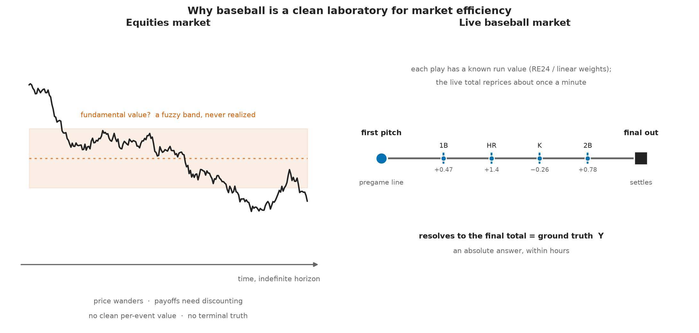
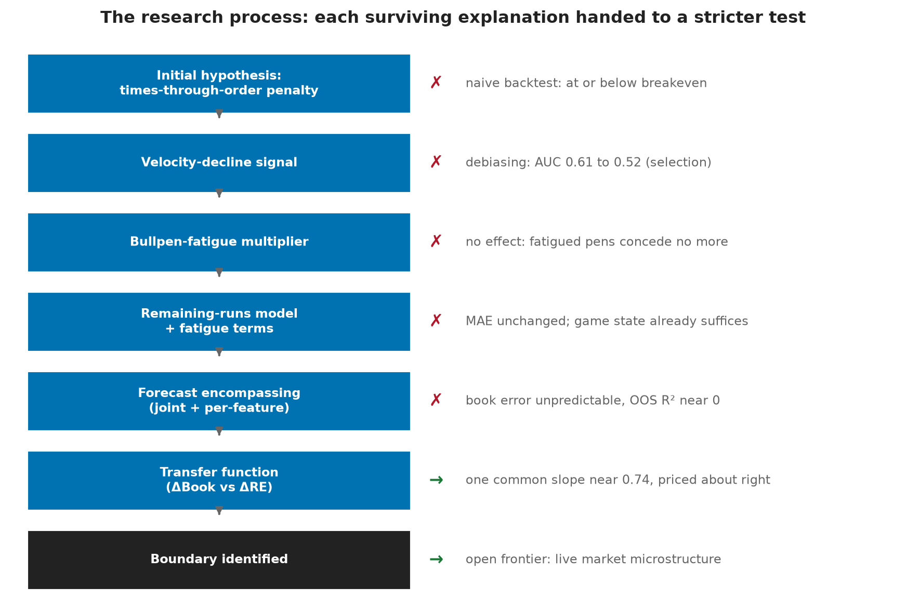
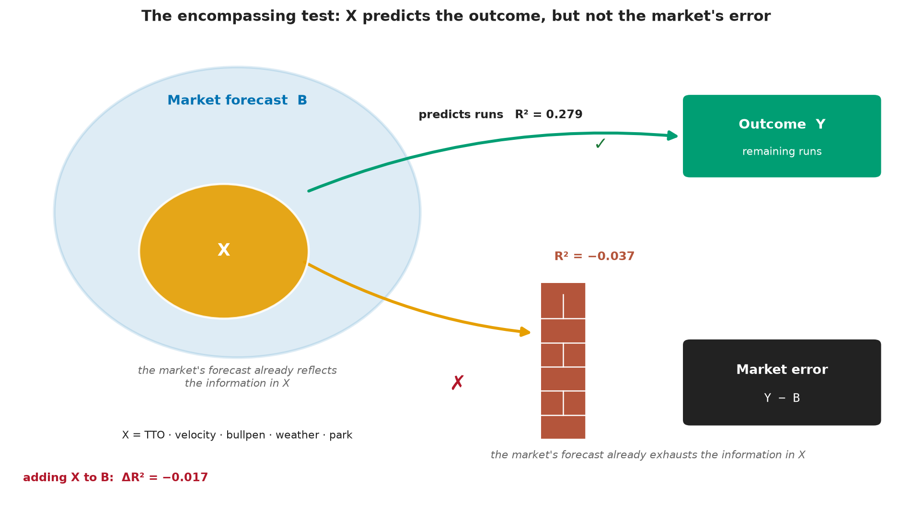
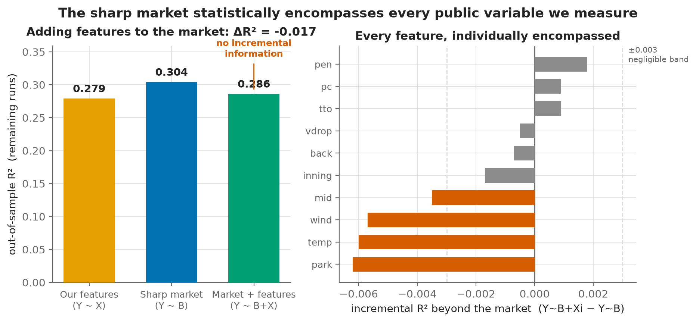
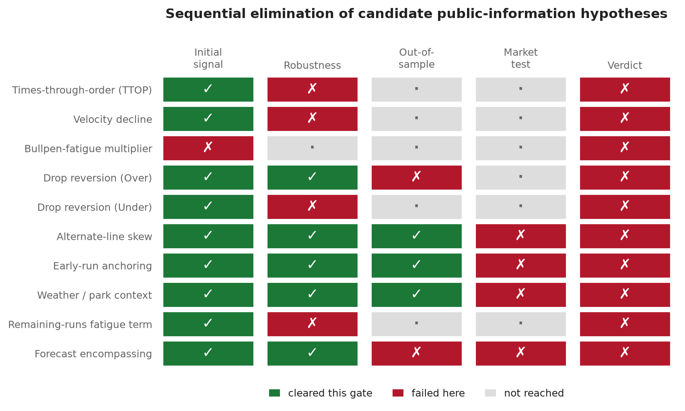
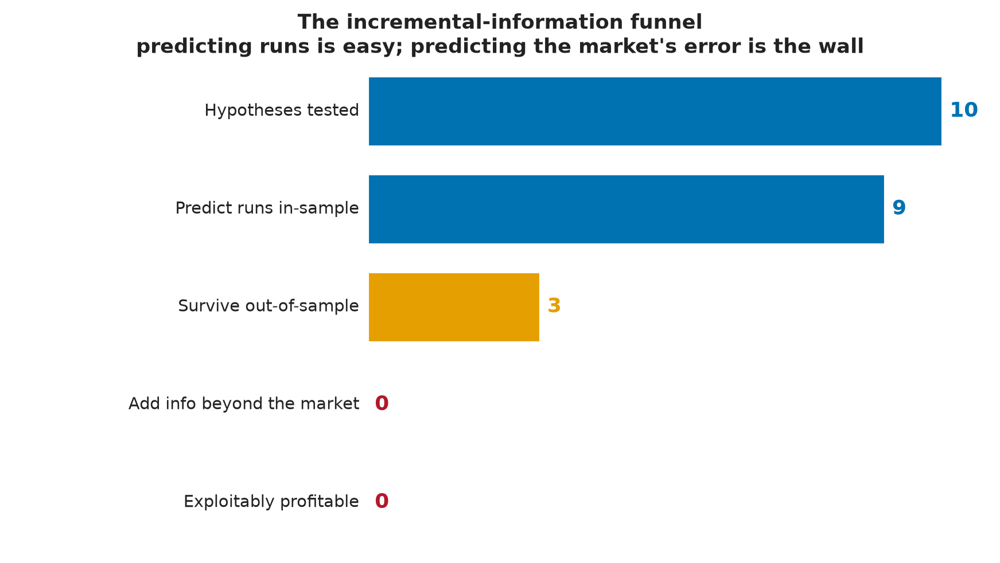
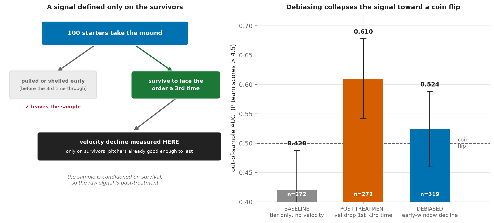
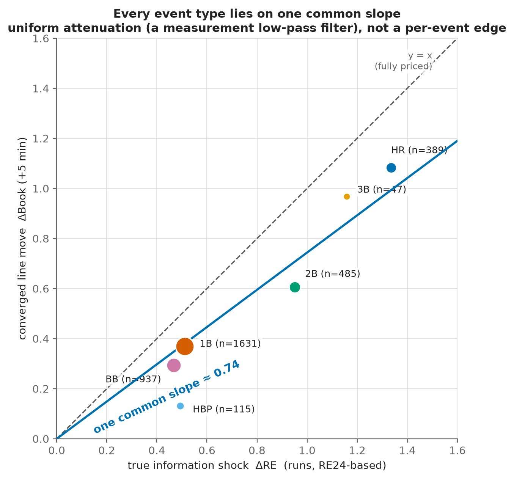
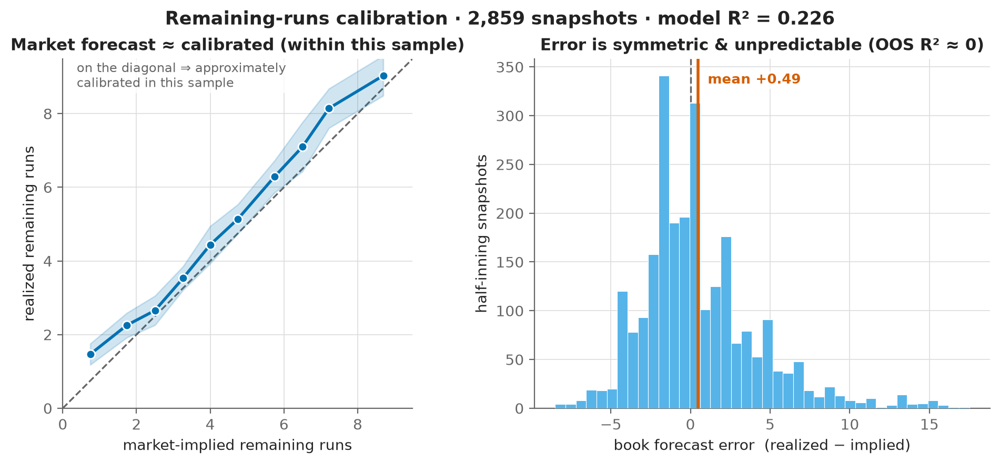

<h1>From Pitcher Fatigue to Market Efficiency: A Forecast-Encompassing Test of Public Information in Live Baseball Wagering Markets</h1>

This paper asks whether publicly observable baseball information predicts outcomes, or merely predicts what the market already knows.

Alec Messino The Third Turn Research Initiative &middot; alec.messino@gmail.com

Working Paper &middot; July 2026 &middot; Comments welcome

<!-- Draft 1.0. Numbers are the committed values in output/*.json and regenerate from the
committed caches. Build the PDF with python3 paper/build_pdf.py. -->

## Abstract

How completely does a high-frequency market capitalize public information? Live, in-play sports
betting offers an unusually clean setting in which to ask, because information arrives as discrete,
well-valued events, prices update continuously, and every contract reaches a known terminal payoff
within hours. Yet the market efficiency literature remains concentrated on pregame prices, leaving
the calibration of live markets and their incorporation of in-game information comparatively
unstudied. We treat a sharp live betting line as an incumbent forecast and apply the Chong and
Hendry (1986) forecast encompassing framework: a public variable earns its place only if it
improves on the market's own forecast of remaining runs, not merely if it predicts the outcome.
Using 163 Major League Baseball games from June 2026, with one-minute live total trajectories,
pitch-level measurement, and full play-by-play, we test whether any publicly observable baseball
state variable (times through the order, velocity decline, bullpen fatigue, line-drop reversion,
alternate-line skew, early-run anchoring, weather, park) carries information the market has not
already priced. None does. The market's forecast error is not predictable out of sample from any
variable we measure (R² of −0.037; a Clark-West nested comparison does not favor the augmented
model), and the design has power to rule out moderate incremental information. The one variable
that appears to beat the market, a starter's velocity decline, is shown to be post-treatment
selection bias: its apparent predictive power collapses to a coin flip once measured before the
outcome selects the sample. An event-level transfer function shows the line absorbing each
information shock by an approximately uniform magnitude, consistent with proportional
capitalization. We name the resulting boundary the efficient frontier of public information, the
point at which additional public variables stop improving on the market forecast, and we
characterize it precisely at the one-minute, single-book resolution of our data. We release the
Third Turn Protocol, a sequential validation ladder built from standard forecast-evaluation tools,
and an accompanying benchmark dataset.

*Keywords:* market efficiency; high-frequency betting markets; forecast encompassing; incremental
information; public-information capitalization; calibration; reproducible benchmark.
*JEL codes:* C53 (forecasting), G14 (information and market efficiency), Z23 (sports economics).

---

## 1. Introduction

Live, in-play wagering has grown from a curiosity into a large and rising share of sportsbook
handle; industry reporting places it at or near half of volume in mature markets. The academic
literature has not kept pace. The economics of wagering markets, surveyed by Sauer (1998), is
built mostly on pregame moneylines and point spreads, where a single closing price can be compared
against a realized outcome. Live markets pose a different problem. Prices update continuously as
the game state evolves, so the object of interest is not one forecast but a stream of them, and
the natural questions concern calibration and the speed and completeness of information
incorporation rather than a one-shot verdict. Whether live markets efficiently absorb the publicly
observable information generated during a game, and how one would even test such a claim, remains
largely open.

Baseball is an unusually clean laboratory for the question, and for much the same reasons that have
long drawn financial economists to betting markets (Thaler and Ziemba, 1988; Sauer, 1998). Each
contract reaches an unambiguous terminal payoff within hours, so there is a ground truth against
which every forecast can be scored, without the discounting, horizon, and never-realized-fundamental
problems that complicate the same test in equities. The game unfolds as a sequence of discrete
events with well-established run values (the RE24 base-out run expectancy table and linear weights),
so the informational content of each event can be quantified rather than estimated. Pitch-level
measurement makes within-game state observable in fine detail: velocity, pitch count, times through
the order. In this setting the efficiency question sharpens to a concrete one, how completely and
how quickly a live price capitalizes the public information the game generates. The sport also
carries a rich stock of public prior belief, most prominently the times-through-order penalty
(Tango, Lichtman, and Dolphin, 2007), the widely held view that a starting pitcher degrades sharply
the third time he faces a lineup. If the live market underprices that deterioration, the live Over
is a profitable bet. This belief is our entry point: concrete, popular, and plausible.[^1]

[^1]: We came to the question honestly. The project began as an attempt to trade the
times-through-order penalty, and the data infrastructure behind this paper was originally built to
generate betting alerts. The name Third Turn refers to that third time through the batting order.
Readers curious how the trading project became an efficiency paper may consult Figure 2, which is
also a short autobiography.

**Figure 1.** Why baseball is a clean laboratory for market efficiency. Left: an equity price wanders around a fundamental value that is never realized, and its payoffs must be discounted over an indefinite horizon. Right: a live baseball game is a sequence of events with known run values (RE24 and linear weights), the live total reprices about once a minute, and within hours the game settles at a final total that is an absolute ground truth, Y. The terminal payoff and the clean per-event valuation, largely absent in asset markets, are what let the efficiency question be posed as a clean forecast comparison.

The question that matters, however, is not whether such variables predict scoring. Many of them
do. The question is whether they carry incremental predictive information once one conditions on
the forecast already embedded in a sharp live market. The distinction between predicting an
outcome and improving an existing forecast of that outcome is the conceptual center of this paper,
and it is routinely blurred in applied betting research, where an in-sample association is often
treated as evidence of an edge. We take the opposite stance. An in-sample signal is the weakest
admissible evidence, and each candidate variable must survive progressively stronger tests,
ending with a forecast encompassing test against the market itself. Within the limits of our
data, no variable does. We read this not as a failure to find an edge but as a measurement of the
boundary at which publicly observable baseball information stops adding value beyond the market.
We map that boundary and bind it to the conditions under which it was measured: 163 games in a
single month, at one-minute cadence, from a single sharp-book feed.

This paper makes three contributions. The first is empirical: using forecast encompassing to
condition on the market's own forecast, we map the efficient frontier of public information for
live baseball totals and find that it binds tightly. No publicly observable baseball variable we
test (times through the order, velocity decline, bullpen fatigue, line-drop reversion,
alternate-line skew, early-run anchoring, weather, park) improves on the sharp live forecast of
remaining runs; the market's forecast error is not predictable from any of them out of sample. The
most instructive case is velocity decline, the one variable that appears to beat the market until
it is exposed as an artifact of post-treatment selection, a result we develop in detail because it
shows precisely how raw prediction misleads. The second contribution is methodological: the
individual tools are standard, and our contribution is their integration into a single escalating
protocol, the Third Turn Protocol (signal, robustness, out of sample, debiasing, conditional
testing, forecast encompassing, transfer function), which shifts the burden of proof from
demonstrating prediction to demonstrating incremental information beyond an existing forecast. The
protocol applies to any market with a sharp public forecast and observable state. The third is
infrastructure: we release the cleaned data and feature schema as the Third Turn Benchmark Dataset
(v1), with reference implementations that operationalize the protocol, so that future hypotheses
can be evaluated against the same yardstick rather than rebuilt from scratch.

The remainder of the paper is organized around one question, which every section serves: do
publicly observable baseball state variables contain incremental predictive information about
remaining runs beyond the forecast embedded in a sharp live betting market?

Box 1. The Third Turn Protocol in brief

1. Does the candidate variable predict the outcome at all? If not, discard it.

2. Does the association survive robustness checks? If not, discard it.

3. Does it survive debiasing? If not, it is a selection artifact, not an effect.

4. Does it improve the market's own forecast? If yes, it is genuinely new information.
If no, it is already in the price.

Only a variable that clears the final gate carries information the price does not already hold.
Every hypothesis in this study reaches that gate and stops.

---

## 2. Related Work

This section is deliberately brief. Its job is to establish a gap, not to survey three
literatures, and we draw on each only for what the design requires.

**Wagering-market efficiency.** The broad finding of the wagering literature (Sauer, 1998) is
that betting prices are accurate but not perfect: systematic deviations such as the
favorite-longshot bias exist, yet rarely survive transaction costs. For baseball specifically,
Woodland and Woodland (1994) document a reverse favorite-longshot bias in the moneyline market and
conclude that the deviations are too small to bet on profitably. This literature is overwhelmingly
pregame. The in-play evidence is thinner and mixed. Croxson and Reade (2014) find that soccer
exchange prices update swiftly and essentially fully when goals arrive, consistent with
semi-strong efficiency. More recent work documents imperfections in the price process itself:
Simon (2024) rejects weak-form efficiency for MLB moneyline movement, finding systematic
overreaction; Simon (2025) extends the negative autocorrelation of price changes to NFL, NBA, and
NHL markets; and Angelini and De Angelis (2026) measure an approximately 0.64-for-one
contemporaneous underreaction to benchmark probability changes in real-time prediction markets,
with predictable subsequent drift.

**Baseball performance.** The times-through-order penalty entered the sabermetric canon through
Tango, Lichtman, and Dolphin (2007). The strongest recent evidence favors continuous decay over a
cliff: Brill, Deshpande, and Wyner (2023) find little support for a discontinuity at the third
time through the order once batter and pitcher quality and other confounders are controlled, a
conclusion our own analysis independently reproduces. Velocity effects on batting outcomes are
real but small per mile per hour; Sutton-Brown (2023) estimates roughly 0.004 wOBA per mph
operating through pitch quality, with a residual direct effect an order of magnitude smaller. Run
values for discrete events, the RE24 table and linear weights, are standard tools from the same
tradition.

**Forecast evaluation.** Our tests come from the econometric forecast evaluation literature. The
pivotal one is the forecast encompassing framework of Chong and Hendry (1986): a benchmark
forecast encompasses a rival when the rival adds no explanatory power for the target beyond the
benchmark. Because our nested models are compared out of sample, we use the tools developed for
that setting: the Diebold and Mariano (1995) comparison of predictive accuracy, West's (1996)
asymptotic theory of predictive inference, the Clark and West (2007) correction for nested model
comparison, and, for the conditional case, Giacomini and White (2006). Calibration diagnostics
(reliability curves, the Brier score, expected calibration error) and the probabilistic
interpretation of the area under the ROC curve (Hanley and McNeil, 1982) complete the toolkit.
None of these instruments is new. Our contribution is to assemble them into one sequential
protocol and to apply it with a sharp live betting line as the benchmark forecast.

**The gap.** These strands study the price series in isolation, or a single discrete shock, or
baseball performance without reference to prices. To our knowledge, no published work combines
live baseball state, pitch-level features, calibration analysis, an event-level transfer function,
and a forecast encompassing test in which a sharp live betting line serves as the benchmark. That
combination is what this paper adds.

---

## 3. Methods

Our design compares two forecasts of the same quantity, the number of runs a game has left to
score at a given moment, and asks whether publicly observable state improves the forecast already
implied by the market. The unit of analysis throughout is the half-inning snapshot: a single
moment in a single game at which both the market's live total and the full game state are
observed. This section describes the data behind each snapshot (Section 3.1), the construction of
the variables (Section 3.2), the escalating protocol by which a candidate is tested (Section
3.3), the estimators applied at each rung (Section 3.4), and the artifacts released for
reproduction (Section 3.5).

### 3.1 Data

The study draws on 163 Major League Baseball games played in June 2026, each observed from three
aligned sources. **Market prices.** Live full-game total (over/under) lines were recorded as
one-minute trajectories from a single Pinnacle-grade feed. From each trajectory we take the main
balanced total, the handicap at which the over and under prices sit closest to even. This is the
market's median-outcome forecast of final total runs, and it serves as the incumbent forecast; its
implied over probability feeds the calibration diagnostics. Appendix B details how a snapshot's
line is matched to game state by timestamp. **Game state.** Complete play-by-play and boxscore
records from the MLB Stats API supply, at every plate appearance, the inning and half, base-out
state, score, batting order position, the identity and pitch count of the pitcher, and the number
of times each batter has faced the current starter. **Pitch measurement.** Pitch-level release
speeds from the same feed provide within-game velocity trajectories. Venue, weather (temperature,
wind speed and direction relative to the field), and each game's realized final total complete the
record. Sources are joined on game identifier and, for odds, on timestamp. The one-minute cadence
and the single odds source are the principal constraints on what the design can measure; their
consequences are collected in Section 6.

### 3.2 Variable construction

From the raw record we construct, at each snapshot, the two forecasts under comparison and the
public state variables that might improve on them. The market forecast of remaining runs is B,
the live total minus runs already scored. The realized remaining runs is Y, the final total minus
runs already scored. The difference Y − B is therefore the market's forecast error at that
snapshot, and its predictability is the object of the study.

The candidate variables are built without reference to the outcome. The starter is the pitcher at
the first plate appearance of each half; batting order slots are assigned by order of first
appearance against that starter; times through the order counts prior batters faced, divided by
nine. Velocity decline is computed two ways, across successive times through the order and within
a fixed early window (the first twenty pitches versus the next twenty), a distinction that turns
out to matter a great deal in Section 3.3. Bullpen quality is each team's season relief runs
allowed per nine innings. Park factors and signed wind and temperature come from static published
tables. The true change in run expectancy at each event, used by the transfer function, is
ΔRE, runs scored plus the change in RE24 run expectancy across the play (Tango, Lichtman, and
Dolphin, 2007). No variable uses information unavailable at the snapshot it describes.

### 3.3 The validation protocol

The core of the design is a fixed sequence of tests of increasing stringency, applied in the same
order to every candidate. A variable is carried forward only until it is eliminated, and we report
the rung at which elimination occurs. The rungs, in order: signal, robustness, out of sample,
debiasing, conditional testing, forecast encompassing, transfer function.

The signal rung asks whether the variable is associated with scoring at all, in sample. The
robustness rung asks whether that association survives reasonable changes in specification,
thresholds, and subsample; an edge that moves with an arbitrary cutoff dies here. The
out-of-sample rung re-estimates every model by leave-one-game-out cross-validation, so a variable
is judged only on games not used to fit it. The debiasing rung replaces any post-treatment
measurement, one defined only on a subsample selected by the outcome, with a pre-treatment
analogue; a signal that survives in sample but vanishes when measured before treatment is
diagnosed as selection, not effect. The conditional rung asks whether the variable earns its keep
on average, not merely inside a hand-picked context such as hitter-friendly weather. The
encompassing rung conditions on the market forecast itself and asks whether the variable adds
anything to it. The transfer function rung, finally, asks not whether the market prices the
variable but whether it prices it by the correct magnitude. One principle organizes the sequence:
a betting hypothesis should be evaluated against the market, not merely against the outcome. The
last two rungs are what enforce it. Figure 2 traces the study's actual path through the ladder.

**Figure 2.** The research process. Each surviving explanation was handed to a stricter test. The
sequence ends at a boundary, not at an edge.

### 3.4 Statistical evaluation

Each rung corresponds to a specific estimator, and everything is computed out of sample by
leave-one-game-out.

**Forecast encompassing** (Chong and Hendry, 1986). For remaining runs Y, market forecast B, and
a candidate feature set X, we fit three ridge-regularized linear forecasts, Y on B, Y on X, and Y
on B and X together, and compare their out-of-sample R² and mean absolute error. If adding X to B
does not improve on B alone, the market encompasses X. The sharpest form of the test regresses the
market's forecast error Y − B directly on X: if X cannot predict the error out of sample, it
carries no information the price lacks. A per-feature variant fits Y on B plus each variable
individually, so that two proxies for the same state cannot hide one another in the joint model.
Continuous predictors are standardized; the ridge penalty is fixed in advance and applied to all
non-intercept terms, and Appendix B confirms the conclusion is unchanged from ordinary least
squares through heavy shrinkage. Because the restricted and unrestricted models are nested, a
naive out-of-sample comparison of mean squared errors is biased against the larger model. We
therefore report the Clark and West (2007) adjusted statistic, clustered by game, together with a
95 percent confidence interval for the encompassing gain obtained by block-bootstrapping whole
games.

Why is encompassing the right test? Ordinary predictive accuracy cannot separate the two claims
this paper must distinguish. A model that predicts runs well shows only that a variable is
informative about the outcome; it says nothing about whether that information is already contained
in an existing forecast. Encompassing answers the second question directly, by conditioning on
the market forecast before evaluating the variable, so that what is being measured is incremental
information rather than raw predictive power. A variable can predict the outcome while adding
nothing beyond the market. As it happens, that describes every variable we tested.

**Figure 3.** The forecast-encompassing test. The sharp market forecast B already reflects the information in the public features X (times through the order, velocity, bullpen, weather, park), drawn here as X contained within B. The features do predict the outcome Y, remaining runs, out of sample (R² of 0.279); but turned on the market's own forecast error, Y − B, they hit a wall (R² of −0.037), because the market's forecast already exhausts the information they carry. Adding X to B changes the out-of-sample R² by −0.017. Predicting the outcome, improving on the market, and turning a profit are three distinct questions, and every candidate in this study clears only the first.

**Calibration.** We assess the market forecast by binning snapshots on B and comparing mean
realized Y in each bin against the identity line, and we assess probabilistic forecasts (for
example, the probability that a team exceeds a run threshold) with reliability curves, the Brier
score, expected calibration error, and the area under the ROC curve. The velocity debiasing of
Section 3.3 is evaluated here as the change in out-of-sample AUC between a baseline forecast and
forecasts augmented with the post-treatment and pre-treatment velocity measures; AUC confidence
intervals use the analytic variance of Hanley and McNeil (1982).

**Transfer function.** For each in-game event we pair the true change in run expectancy ΔRE with
the change in the live total one and five minutes later, and estimate the response ratio by event
type together with a single common slope through the origin. Mean ΔRE by event type is checked
against published linear weights as a validity control.

**Statistical power.** Because the paper's claims are null claims, we report what the design could
have detected. For the ten-feature test of incremental information, 80 percent power at the 5
percent level corresponds to a minimum detectable incremental R² of roughly 0.007 if the 2,505
snapshots are treated as independent, rising to roughly 0.10 under the conservative assumption
that only the 163 games are independent; the truth lies between. Every observed per-feature
increment (at most 0.0018) sits below even the optimistic floor. In betting terms, detecting a 55
percent win rate against the 52.4 percent break-even at 80 percent power would require on the
order of 2,000 wagers, so our few hundred qualifying situations can rule out large edges but not
tiny ones. Appendix B gives the full calculation.

**Uncertainty.** All point forecasts are out of sample. Interval estimates use the Hanley and
McNeil formula for AUC, Wilson intervals for proportions, and the bootstrap otherwise. Differences
smaller than the width of their intervals are reported as such and are not interpreted as effects.

### 3.5 Reproducibility

Every quantity in this paper is recomputed from committed inputs by a fixed set of scripts, and
estimation is deterministic, so results regenerate exactly. We release the cleaned data and
feature schema as the Third Turn Benchmark Dataset (v1), together with reference implementations
of the market forecast, the remaining-runs model, the encompassing tests, and the transfer
function, an executable form of the protocol in Section 3.3. The frozen result files and the
scripts that produce them are sufficient to reconstruct every figure and number without access to
the original feeds.

---

## 4. Results

The result is organized around a single test. We treat the sharp live line as the incumbent
forecast and ask, following Chong and Hendry (1986), whether any public variable improves on it.
Figure 4 answers that question directly; the remaining figures explain why the answer takes the
form it does, and one of them, the velocity case in Figure 7, shows in miniature how a variable can
predict the outcome and still add nothing to the price.

Figure 4 shows that publicly observable baseball variables provide no measurable incremental
predictive information beyond the live market. Across 2,505 half-inning snapshots, a
leave-one-game-out forecast of remaining runs from our full feature set achieves an out-of-sample
R² of 0.279. The market-implied remaining total alone achieves 0.304. Combining the two changes R²
by −0.017: adding the features to the market does not improve the forecast, and in fact slightly
degrades it. The right panel repeats the test one feature at a time. The largest individual
increment beyond the market is +0.0018 (bullpen quality); the rest sit near or below zero, with
the largest negative values (park, temperature, wind) near −0.006, so no single variable is hiding
behind the others. The sharpest version of the test regresses the book's forecast error, realized
minus market-implied remaining runs, directly on the features. It is not predictable out of
sample: R² of −0.037. This is the central empirical result of the study. The uncertainty around it
is modest and quantified. The encompassing gain of −0.017 carries a 95 percent block-bootstrap
confidence interval of [−0.036, +0.002], resampling whole games, and a Clark-West nested
comparison does not reject equal predictive accuracy in the market's favor (statistic −0.1,
one-sided p-value 0.55). If anything, the market alone is the better forecast. We emphasize that
encompassing is the most demanding standard applied in this paper, because it conditions on the
market's own forecast rather than on realized outcomes alone. A variable clears it only by
improving a forecast that already reflects everything the market knows.

**Figure 4.** Forecast encompassing. Left: adding the feature set to the market forecast changes
out-of-sample R² by −0.017. Right: each feature's individual incremental R² beyond the market;
bars inside the 0.003 band are drawn in neutral gray.

Figure 5 shows that this boundary is a property of the whole class of public variables, not an
accident of one unlucky choice. It arranges the candidate hypotheses from the public handicapping
tradition (times through the order, velocity decline, bullpen fatigue multipliers, drop reversion
in both directions, alternate-line skew, early-run anchoring, weather and park context, a
remaining-runs fatigue term, and the joint encompassing test) against the successive tests each was
put to: initial signal, robustness, out of sample, and the market test, with the verdict in the
final column. What matters is not the tally but where the candidates fall. The fatal test varies by
row, times through the order and the velocity signal at robustness, drop reversion and the joint
model out of sample, the context variables at the market test, so that no single artifact, whether
a coding error, one anomalous month, or one misspecified model, can be the common cause. The
encompassing boundary is reached by many independent routes, which is the sense in which it is a
property of the market rather than of any one variable. The full list, with each hypothesis's
motivation and mode of elimination, appears in Appendix Table A1.

**Figure 5.** Where each public-information candidate fails relative to the market forecast, across
successive tests. Green: cleared this test. Red: failed here. Gray: not reached.

Figure 6 restates the same evidence as a funnel, and isolates the one transition that carries the
paper's economic content. Nine of the ten candidates produce a detectable in-sample association
with runs, three survive out-of-sample validation, and none adds information beyond the market. The
collapse at the final step, from variables that predict runs to variables that improve the price,
is the distinction the encompassing test exists to draw: predicting runs is common, predicting a
sharp market's error is the wall.[^2] The counts derive directly from the Figure 5 classification,
so the two figures cannot disagree.

[^2]: Predicting runs is not hard. Predicting runs better than a firm that prices them for a
living, and doing so after the vig, is a different occupation.

**Figure 6.** The incremental-information funnel: from predicting runs to improving the price.
Counts derive from the Figure 5 classification.

Figure 7 develops the velocity case at length, because it is the clearest illustration in the
study of how a variable can predict an outcome and still be worthless against the market, and
because catching it is the single most important thing the protocol does. A model that adds the
starter's velocity decline, measured from the first to the third time through the order, raises the
out-of-sample AUC for the event "team scores more than 4.5 runs" from a baseline of 0.420 to 0.610.
Taken at face value that is a large edge, and a study that stopped at out-of-sample prediction, as
much betting research does, would report it as one. But the velocity-drop variable is
post-treatment: it is defined only for starters who survived long enough to face the order a third
time, which is to say, precisely the starters already being hit. Re-measuring velocity decline in a
pre-treatment window (the first twenty pitches versus the next twenty) collapses the AUC to 0.524,
with a confidence interval that straddles the 0.500 coin-flip line. The apparent signal was
survivorship, not fatigue. This is exactly the class of artifact the debiasing rung exists to
catch, and it is why the protocol places debiasing before the market test rather than after: a
variable disqualified as a selection artifact never reaches the encompassing stage at all.

**Figure 7.** Post-treatment bias in the velocity signal. Left: the velocity-decline measure is
defined only on starters who survive to face the order a third time, so the sample is conditioned on
survival, precisely the pitchers already effective enough to last. Right: out-of-sample AUC for the
event that a team scores more than 4.5 runs, with Hanley and McNeil 95 percent intervals.
Conditioning on the third time through inflates the AUC to 0.610; measuring velocity decline instead
in a pre-treatment early window collapses it to 0.524, an interval that straddles the coin flip.

Figure 8 turns from whether the market prices information to whether it prices it by the right
amount. For each of 6,414 in-game events we compute the true change in run expectancy, ΔRE, and
the change in the live total five minutes later. Plotted against each other, every positive-run
event type lies on a single common slope of approximately 0.74 through the origin. The response
ratios for the frequent events cluster in a narrow band from 0.63 to 0.84 (walk 0.63, double 0.64,
single 0.72, home run 0.81, triple 0.84), with no ordering by event magnitude. That uniformity is
evidence about the measurement pipeline rather than the market: a single source sampled at
one-minute cadence acts as a low-pass filter that attenuates every shock by roughly the same
factor. A per-event mispricing would show up as asymmetry across event types, and there is none.
(Hit by pitch, with 115 events, sits below the band; pitching changes barely move the line, but
RE24 cannot value the incoming reliever, so we exclude them from the elasticity claim.)

**Figure 8.** The market transfer function. Every positive-run event type lies on one common slope
of roughly 0.74; marker area is proportional to event count.

Figure 9 closes the loop on the model side. The left panel bins the 2,505 snapshots by
market-implied remaining runs and plots mean realized remaining runs in each bin. The points track
the diagonal, so the market forecast is approximately calibrated within this sample. (The
underlying leave-one-game-out remaining-runs model, fit on 2,859 snapshots, reaches an R² of
0.226, and adding fatigue terms leaves its mean absolute error essentially unchanged, about 0.001
runs, if anything slightly worse.) The right panel plots the distribution of the book's forecast
error, and it contains the one number in this study that initially looked like a smoking gun. The
error's median is zero, but its mean is +0.49 runs. The resolution is not market bias but
arithmetic.[^3] Remaining runs are right skewed (skewness +1.23), a balanced betting line sits at
the median outcome, and realized runs and any least-squares forecast track the higher mean. The
gap is a level term: regressing the error on the forecast gives a slope of +0.01, so any model
with an intercept absorbs it, and it never enters the incremental information comparisons.
Appendix B documents this in full. Beyond that intercept, the error is not predictable from any
variable we measure. Together with Figure 4, this defines the empirical boundary of
public-information prediction against a sharp live market, at the one-minute, single-book
resolution of our data.

[^3]: A forecast can look biased simply because the researcher asked it for the mean when it was
offering the median. We spent an uncomfortable afternoon on this point.

**Figure 9.** Market calibration. Left: binned market-implied versus realized remaining runs.
Right: the distribution of the market's forecast error.

**Summary.** At every stage of the analysis, variables that predicted runs failed to provide
incremental information once conditioned on the live market. The remaining sections interpret the
boundary, draw out its methodological implications, and state what remains genuinely open.

---

## 5. Discussion

The question was whether publicly observable baseball state variables contain incremental
predictive information about remaining runs beyond the forecast embedded in a sharp live betting
market. Within the limits of our data, they do not. This section says what that means, why it
happens, why it matters outside baseball, and where the evidence runs out.

### 5.1 What the boundary means

The question was never whether baseball variables predict runs. They do. Pitch count, inning,
pitcher quality, weather, park, and velocity all contain information about future scoring, and our
own feature-only forecast (out-of-sample R² of 0.279) confirms it. The question was narrower and
economically more meaningful: after conditioning on the forecast already embedded in a sharp live
market, do these variables provide additional predictive information? The answer, in our data, is
no.

That distinction disarms the most natural objection in advance. A reader may protest that weather
obviously matters, or that a tiring pitcher obviously concedes more runs. Both are true, and
neither is the point. Encompassing does not deny that these variables carry signal; it asks
whether the signal is already in the price. When the market's forecast error cannot be predicted
from any of these variables out of sample (R² of −0.037), the parsimonious reading is that the
information is already incorporated in the market forecast. The variables are informative about
runs and redundant with the price. Prediction survives. Increment does not.

Why should this be so? Not because baseball theory is wrong, but because the forecast embedded in
a sharp live market is produced by participants with strong incentives to price observable state
quickly, and it already reflects these variables. The transfer function evidence is consistent
with that account: the line moves proportionately to the true change in run expectancy after
every event type, with no class systematically mispriced. A forecast that adjusts proportionately
to information shocks is exactly the kind whose residual carries no recoverable public-information
signal, and that is what we observe.

### 5.2 Prediction is not profit

Here the paper stops being about baseball. Prediction and profit are distinct statistical
problems, and conflating them is among the most common errors in applied betting research.

Much of that literature assumes a single arrow: better prediction leads to better betting. Our
results break the arrow into three links that must each hold on their own. A variable may predict
an outcome; velocity decline is associated with more runs. It may nonetheless carry no incremental
information once the market forecast is conditioned on, because the price already reflects it. And
even a variable that did carry incremental information would not automatically be profitable,
since profit further requires that the edge exceed transaction costs, survive the vig, and persist
after the act of betting moves the line. Prediction, increment, and profit are three questions,
not one.

Encompassing matters because it isolates the middle link, the one betting studies most often
skip. A naive backtest speaks to prediction. A profit-and-loss simulation speaks to the third
link, and is easily flattered by overfitting and stale lines. Encompassing asks the middle
question directly: does this variable improve on what the price already reflects? Because the test
addresses increment rather than any particular staking scheme, our negative answer does not depend
on how one would have bet.[^4]

[^4]: We placed no wagers on the strength of these results. Given the results, this required no
discipline whatsoever.

### 5.3 The efficient frontier of public information

We give the boundary a name: the efficient frontier of public information, the point at which
additional publicly observable variables stop improving prediction once the market forecast is
conditioned on. It is the live-market analogue of the classical statement of semi-strong
efficiency, that price already reflects all public information, made operational as a forecast
comparison rather than an event study and measured at the frequency at which the information
actually arrives. Inside the frontier lie the observable baseball variables, pitch count, starter
quality, bullpen, park, weather, velocity, times through the order, all of which the market
encompasses. Outside it lie the dimensions our data cannot reach: the timing of price formation,
disagreement across books, and the evolution of the full implied distribution rather than its
mean.

One caution bounds the claim. What we observe is limited by the resolution of our instrument, a
single sharp book sampled once a minute, and not necessarily by the resolution of the market. A
lag that resolves within the minute, or a disagreement visible only across books, would be
invisible to us and would register, incorrectly, as efficiency. Our result is therefore that
public baseball variables carry no incremental information at the one-minute, single-book
resolution of our data. Finer-grained or cross-book measurement could move the boundary, and
mapping that is the subject of the follow-on work sketched in Section 7.

Every hypothesis in this study was, in effect, an attempt to cross the frontier with public state
variables, and none succeeded. We do not read this as ten separate disappointments. It is one
coherent measurement of where the frontier sits for one sport, one month, and one class of
information, and it tells the next researcher where not to dig.

### 5.4 The methodological contribution

Although the motivation was baseball, nothing in the method is baseball-specific. The components,
cross-validation, selection-bias correction, forecast encompassing, nested forecast comparison,
are individually standard. The contribution is their integration into a single escalating
protocol that separates variables which predict outcomes from variables that carry information
not already reflected in an existing forecast. Each rung strips away one class of illusion:
overfitting, then selection, then confounding, then redundancy with the market. A hypothesis that
survives to the top has been tested against progressively harder alternatives rather than a
single easy one.

The reason a protocol like this matters is the location of the burden of proof. Sports betting
research frequently ends at the discovery of an in-sample signal. This study treated each positive
result as a hypothesis requiring progressively stronger attempts at falsification. The protocol
therefore shifts the burden from demonstrating prediction to demonstrating incremental
information beyond an existing market forecast, a higher and more economically meaningful
standard, and one that no single backtest can meet. That shift is a philosophy of evidence, not
merely a workflow.

The ladder transfers unchanged to any market with a sharp public forecast and observable state:
NBA totals, NFL spreads, soccer in play, tennis, racing. A researcher in any of these settings can
adopt the same sequence, report the rung at which each candidate is eliminated, and compare
results across domains. We call the sequence the Third Turn Protocol and release its reference
implementation with the accompanying data as the Third Turn Benchmark Dataset (v1). A citable
protocol and a shared dataset may prove more durable than any single finding, because they let a
field accumulate falsifications rather than scattered one-off backtests.

---

## 6. Limitations

We state the conditions under which the conclusion holds, without editorializing. **Scope.** The
study covers 163 games in a single month (June 2026) of one sport. The boundary is characterized
precisely, but only under those conditions, and we claim no seasonal or cross-sport generality. A
second month of live data is being collected and will be added before journal submission to test
temporal stability. **Odds source.** Line trajectories come from a single Pinnacle-grade feed
sampled at roughly one-minute intervals, so we cannot separate genuine price-formation latency
from feed cadence, and the uniform sub-one response ratio in the transfer function is consistent
with either. **Single-book benchmark.** All encompassing tests run against one sharp book; we
cannot test cross-book agreement or leadership. **Market coverage.** Retail live team totals were
not exposed by our feeds and are untested, as are first-five-inning totals. **Ground truth.** The
remaining-runs model and the RE24 transfer benchmark use published static run values rather than
park- or season-specific re-estimates, and the pitching-change response is reported but excluded
from the elasticity claim because RE24 cannot value the incoming reliever. **Estimation.**
Out-of-sample figures are leave-one-game-out, and effective sample sizes for the rarer events
(triples, 47) are small; the corresponding ratios should be read accordingly. None of these
conditions is load-bearing for the central result, that the book's forecast error is unpredictable
from every variable we measure, but each bounds how far it generalizes.

---

## 7. Remaining Questions

Distinct from the limitations, this section lists what the evidence genuinely does not answer:
questions open not because the experiment was narrow but because they require data the historical
record cannot provide. Does information propagate across books with a measurable lag, and is a
laggard ever worth trading? Does the market update the shape of the implied run distribution, its
variance, skew, and tails, as accurately as it updates the mean, or is higher-moment
miscalibration where a residual edge hides? What is the information half-life of a shock: how long
does the line take to absorb a home run, a pitching change, an injury? Does the boundary we map
for full-game totals move when the market isolates the starters, as first-five-inning totals do?
Each is a live-data question. None is answerable from one-minute snapshots of a single book, and
each is the natural subject of the market microstructure study that our forward-collected,
timestamped price and state streams are being assembled to support.

---

## 8. What We Learned

This project began as a search for an exploitable feature of baseball. It ended by identifying the
empirical boundary at which publicly observable baseball information stops providing incremental
predictive value against a sharp live market. That boundary is itself a result. It redirects
future work away from the discovery of additional baseball variables and toward the study of how
information propagates through live betting markets. The contribution of this paper is therefore
not a betting strategy but a reproducible procedure for telling the difference: a way to
distinguish variables that predict outcomes from variables that carry information not already
reflected in an existing forecast. We went looking for an edge and found a boundary. Of the two,
the boundary has proved the more useful.

---

## Appendix A. The full list of candidate hypotheses

Referenced from Section 4; Figure 5 is the main-text representation.

| Hypothesis | Motivation | Test | Outcome | Mode of elimination |
|---|---|---|---|---|
| Times through the order | Familiarity penalty on the third time through | Binary gate, then gradient model; leave-one-game-out | Encompassed | Decay is continuous, not a cliff; out-of-sample fires below break-even; market prices it |
| Velocity decline | Fatigue shows up as lost velocity | Debiased early window versus post-treatment | Artifact | Defined only for starters who lasted long enough to be measured (selection); clean signal AUC near 0.52 |
| Bullpen fatigue | Tired bullpen concedes more after a starter exits early | Isolated to the bullpen's own innings | No effect | Tired bullpens concede the same or fewer runs; no multiplier |
| Drop reversion (over) | A line that has fallen far reverts upward | Threshold sweep, all games | Not out of sample | Reversion is right skewed (win big, lose small); the median finishes below the line |
| Drop reversion (under) | The line stays low after a slow start | Banded splits plus robustness gates | Not robust | The effective band moves with the snapshot inning; concentrated in the recent subsample |
| Alternate-line skew | Buy the fat upper tail at longer odds | Empirical win rate versus efficient-implied | Priced | Empirical falls short of implied at every half-run increment; the tail is priced fatter than it realizes |
| Early-run anchoring | The live total underreacts to a first-inning scoring burst | Post-first-inning over, split by cause | Priced | 49 of 50 bursts were hit-driven, leaving no fluky-runs population; the market prices the change |
| Weather and park | Books underprice hitter-friendly conditions | Conditional split | Priced | Hitter-friendly overs hit less often (46 versus 50 percent): the market over-adjusts |
| Remaining-runs fatigue | Fatigue improves a game-state model | Incremental MAE, leave-one-game-out | No increment | Game state already contains the information; the MAE change is nil |
| Joint encompassing | Does anything beat the market? | Y on B and X; error on X; per-feature variant | Encompassed | The book's forecast error is not predictable from any feature out of sample |

---

## Appendix B. Construction, power, and the forecast-error level

**Snapshot construction.** The unit of analysis is the first plate appearance of each half-inning
through the eighth for which a live line is available. Game state (inning, half, base-out state,
score, batting slot, pitcher, pitch count, times through the order) is read from the play-by-play
at that plate appearance, and the market line is matched by timestamp, using the most recent quote
at or before the plate appearance's start. The incumbent forecast is B, the main total minus runs
already scored; the target is Y, the final total minus runs already scored.

**Sample sizes.** The three analyses use overlapping but distinct samples, by construction. The
encompassing and calibration analysis uses 2,505 half-inning snapshots (innings one through eight
with a matched line). The remaining-runs baseline uses 2,859 half-inning states; it does not
require a market line, so a few more states qualify. The transfer function uses 6,414 events
rather than snapshots, every run-scoring play and pitching change with a usable before and after
line, which is a different unit entirely.

**The forecast-error level.** The book error Y − B has mean +0.489 and median 0.000, on snapshots
whose remaining-runs distribution has skewness +1.23. This is the mean-median gap of a
right-skewed count distribution. A balanced betting line sits at the median outcome, while
realized runs and any least-squares forecast track the higher mean. Regressing the error on B
gives a slope of +0.014, so the gap is a constant level rather than a function of the forecast;
any model with an intercept absorbs it, and it does not enter the incremental information
comparisons. It is a property of the forecast's target functional, not evidence of market bias.

**Nested forecast comparison.** Comparing the nested out-of-sample forecasts by raw mean squared
error is biased toward the smaller model; the Clark and West (2007) adjustment corrects this. The
market model has the lower MSPE, 13.79 against 14.14. The Clark-West statistic, clustered by
game, is −0.1 (one-sided p-value 0.55), so we do not reject equal predictive accuracy in the
market's favor. Block-bootstrapping whole games, the encompassing gain is −0.017 with a 95 percent
interval of [−0.036, +0.002].

**Power.** For the ten-feature test of incremental information, 80 percent power at the 5 percent
level requires an incremental R² of about 0.007 when the 2,505 snapshots are treated as
independent, and about 0.10 when only the 163 games are. Every observed per-feature increment
(at most 0.0018) is below the former. A 55 percent win rate against the 52.4 percent break-even
would need roughly 2,000 wagers to detect at 80 percent power. The design excludes moderate
incremental information, not arbitrarily small amounts.

**Penalty sensitivity.** The encompassing conclusion is invariant to the ridge penalty. From
ordinary least squares through heavy shrinkage, the encompassing gain stays between −0.017 and
−0.013, and the out-of-sample R² for predicting the book error stays between −0.037 and −0.034.
The features never improve on the market.

| Ridge penalty | R², market | R², features | R², both | Gain | Error R² |
|---|---|---|---|---|---|
| 0 (OLS) | 0.304 | 0.279 | 0.286 | −0.017 | −0.037 |
| 1 | 0.304 | 0.279 | 0.286 | −0.017 | −0.037 |
| 10 | 0.304 | 0.279 | 0.287 | −0.017 | −0.037 |
| 100 | 0.303 | 0.281 | 0.290 | −0.013 | −0.034 |

All Appendix B numbers are produced by a single committed script from the frozen inputs.

---

## Data and code availability

The cleaned data, feature schema, and frozen result files are released as the Third Turn Benchmark
Dataset (v1), and the Third Turn Protocol is specified in an accompanying document with a
safeguard registry and objective stopping rules; reference implementations reproduce every number
reported here from the committed inputs. A persistent DOI and packaged archive are pending
publication. Until then, materials are available from the author.

## References

Angelini, G., and L. De Angelis (2026). "When Do Markets Fully Process Public Information?
Evidence from Real-Time Prediction Markets." arXiv:2606.07811.

Brill, R. S., S. K. Deshpande, and A. J. Wyner (2023). "A Bayesian Analysis of the Time Through
the Order Penalty in Baseball." *Journal of Quantitative Analysis in Sports* 19(4): 245-262.

Chong, Y. Y., and D. F. Hendry (1986). "Econometric Evaluation of Linear Macro-Economic Models."
*Review of Economic Studies* 53(4): 671-690.

Clark, T. E., and K. D. West (2007). "Approximately Normal Tests for Equal Predictive Accuracy in
Nested Models." *Journal of Econometrics* 138(1): 291-311.

Croxson, K., and J. J. Reade (2014). "Information and Efficiency: Goal Arrival in Soccer Betting."
*The Economic Journal* 124(575): 62-91.

Diebold, F. X., and R. S. Mariano (1995). "Comparing Predictive Accuracy." *Journal of Business &
Economic Statistics* 13(3): 253-263.

Giacomini, R., and H. White (2006). "Tests of Conditional Predictive Ability." *Econometrica*
74(6): 1545-1578.

Hanley, J. A., and B. J. McNeil (1982). "The Meaning and Use of the Area Under a Receiver
Operating Characteristic (ROC) Curve." *Radiology* 143(1): 29-36.

Sauer, R. D. (1998). "The Economics of Wagering Markets." *Journal of Economic Literature* 36(4):
2021-2064.

Simon, J. (2024). "Inefficient Forecasts at the Sportsbook: An Analysis of Real-Time Betting Line
Movement." *Management Science*, doi:10.1287/mnsc.2022.00456.

Simon, J. (2025). "Autocorrelation and Weekend Effects: Inefficiencies in Moneyline Movement for
Three Major Sports." *International Journal of Sport Finance* 20: 211-231.

Sutton-Brown, S. (2023). "The Value of Relative Velocity." *Baseball Prospectus*, December 14,
2023.

Tango, T., M. Lichtman, and A. Dolphin (2007). *The Book: Playing the Percentages in Baseball.*
Potomac Books.

Thaler, R. H., and W. T. Ziemba (1988). "Anomalies: Parimutuel Betting Markets: Racetracks and
Lotteries." *Journal of Economic Perspectives* 2(2): 161-174.

West, K. D. (1996). "Asymptotic Inference About Predictive Ability." *Econometrica* 64(5):
1067-1084.

Woodland, L. M., and B. M. Woodland (1994). "Market Efficiency and the Favorite-Longshot Bias:
The Baseball Betting Market." *Journal of Finance* 49(1): 269-279.
