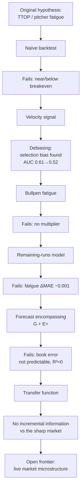

# Paper 1 — Outline & Draft Skeleton (v2)

**Reframe (v2):** this is **not a betting paper** — it is an **empirical market-efficiency
paper**. Pitcher fatigue / TTOP is one *case study* within a general question. Every
section reflects that shift.

**Title (primary):** *From Pitcher Fatigue to Market Efficiency: An Empirical Evaluation
of Public Information in Live MLB Totals Markets*
**Alt:** *Do Public Baseball Variables Add Incremental Information Beyond Sharp Live
Betting Markets? Evidence from Escalating Validation Tests*
(Deliberately does **not** lead with "market efficiency"; the subtitle names the design.)

Status: historical phase complete. Prose drafted for anchor sections; language bound to
the experiment (claims are "no evidence of incremental information within our data," never
"the market is efficient").

---

## Three contributions (state explicitly in the Introduction)

1. **Incremental information (primary, statistical).** For each public variable (TTOP,
   velocity, fatigue, bullpen, park, weather, pitch count) we ask *"does it survive
   conditioning on the market?"* — not merely *"does it predict runs?"* — via escalating
   tests culminating in forecast encompassing. Predicting runs ≠ predicting book error.
2. **A methodology for evaluating betting hypotheses (framework).** The test sequence —
   naïve backtest → robustness → debiasing → conditional testing → forecast encompassing →
   transfer function — is domain-general and transfers to NBA/NFL/soccer/tennis/racing.
   We present it as a reusable protocol.
3. **A reproducible benchmark (sleeper).** The calibration engine, encompassing tests,
   remaining-runs model, and transfer-function code + cleaned data give future researchers
   something concrete to compare against.

---

## Abstract (draft, ~180 words)

Live in-play betting is now a majority of sports-wagering volume, yet market-efficiency
research concentrates on pregame moneylines; live totals and calibration remain little
studied, especially for baseball. We ask whether publicly observable baseball state
variables carry *incremental* predictive information about remaining runs beyond the live
total posted by a sharp market. Using 163 MLB games (June 2026) with one-minute live-odds
trajectories (Pinnacle-grade), pitch-level Statcast, and full play-by-play, we subject a
sequence of community hypotheses — times-through-order, velocity decline, bullpen fatigue,
drop reversion, alternate-line skew, early-run under-reaction, weather/park — to escalating
validation: out-of-sample cross-validation, selection-bias debiasing, context-controlled
conditioning, and finally a forecast-encompassing test against the market itself. No
variable survives. A game-state remaining-runs model is well-calibrated (R²≈0.22) but
fatigue terms change its error by <0.001 runs; the market's forecast error is not
predictable from any feature we measure (out-of-sample R²≈0). An event-level transfer
function shows the sharp line adjusts to information shocks by approximately the correct
magnitude. Within our data, we find no evidence of exploitable public-information
inefficiency, and we characterize the boundary precisely. We contribute a transferable
protocol for testing betting hypotheses and a reproducible benchmark.

---

## Figure 1 — the research process (the paper's spine; draft below)

*Start the paper with the process, not with baseball.*

## 1. Introduction
- Live/in-play betting dominates handle; efficiency research is pregame-centric. Live
  totals + calibration are under-studied.
- MLB as testbed: discrete events with established run values (RE24, linear weights),
  Statcast, and a strong community prior.
- **Reframe:** we evaluate *incremental information beyond a sharp market*, using TTOP as
  the entry case study. State the three contributions. Preview the negative result + scope.

## 2. Related Work
TTOP as continuous familiarity (arXiv 2210.06724); relative-velocity ≈ 0.0006 wOBA/mph
(BP); betting-market overreaction/autocorrelation (Simon 2025); real-time inefficiency
(*Management Science* 2024); underreaction ~0.64:1 (arXiv 2606.07811). Gap: none combine
pitch-level state, live totals, calibration, and encompassing vs a sharp book.

## 3. Data
163 games, June 2026; ~1-min live totals + O/U prices (Odds Papi, Pinnacle-grade); MLB
Stats play-by-play + boxscore; Statcast `startSpeed`; weather + venue; realized finals.
Derived substrate `features.py`. Report coverage, cadence, single-source caveat.

## 4. Methods — escalating stringency (the protocol; one subsection each)
Naïve reversion → gradient signal → vector battery (V1–V4) → calibration engine →
velocity debiasing → remaining-runs model → forecast encompassing (G, E+) → transfer
function (A, RE24-based ΔRE). Emphasize each test is *more* stringent than the last.

## 5. Results (organize the failures — the paper's strength)
- **5.1 Hypothesis battery table** (see Appendix A for the full one-page version).
- **5.2 Remaining-runs:** baseline R²=0.224 (calibrated); + fatigue → ΔMAE = −0.001.
- **5.3 Encompassing (G+E+):** market R²=0.304 > features 0.279; adding features ΔR²=−0.017;
  book error not predictable OOS (R²=−0.037); per-feature ΔR² ≤ 0.002.
- **5.4 Transfer function (A):** ΔRE validated vs linear weights (HR 1.34/1.40); response
  ratios 0.63–0.84, *uniform* → measurement low-pass filter, not per-event inefficiency.

## 6. Discussion (restructured — where the paper becomes memorable)
- **6.1 Why intuitive baseball hypotheses failed.** Not because baseball theory is wrong —
  because sharp sportsbooks already know baseball. The variables predict runs; the market
  reflects them.
- **6.2 Prediction ≠ profit.** The central distinction most betting papers miss: a variable
  can predict *runs* without predicting *sportsbook error*. Forecast encompassing separates
  the two directly; every feature is predictive yet non-incremental.
- **6.3 The efficient frontier of public-information baseball betting.** *Inside* the
  frontier: observable baseball variables — the market encompasses them. *Outside*:
  microstructure (timing, cross-book, distribution) — still open. Our project maps the
  frontier. (Introduce this phrase as the conceptual contribution.)

## 7. Limitations (prominent)
One month; 163 games; ~1-min snapshots; single Pinnacle-grade source (cannot separate
latency from feed cadence, nor test cross-book); no retail live team totals; June-only.
Claims bound to these conditions.

## 8. Future Work → Paper 2
Live microstructure on the banking streams: price discovery `P(A→B)`, information half-life
`τ½`, cross-book leadership, distribution dynamics (μ/σ/skew/tail), market compression,
pitching-change repricing.

---

## Appendix A — every hypothesis, one page

| Hypothesis | Motivation | Test | Outcome | Why it failed |
|---|---|---|---|---|
| Times-through-order | Familiarity/fatigue penalty on 3rd time through | Binary gate → gradient, LOGO | Refuted | Decay is continuous, not a cliff; OOS fires −EV; market prices it |
| Velocity decline | Fatigue shows as lost mph | Debiased early-window vs post-treatment | Artifact | `vel_drop_13` defined only if starter survived to be shelled (selection); clean signal AUC≈0.52 |
| Bullpen fatigue | Gassed pen → higher scoring after a cliff | Isolated to the pen's own innings | Refuted | Gassed pens concede the same/fewer runs; no multiplier |
| Drop reversion (Over) | Over-dropped line reverts up | Threshold sweep, all games | Refuted | Reversion is right-skewed (win-big/lose-small); median below line |
| Drop reversion (Under) | Line stays low after a slow start | Banded + robustness gates | Not robust | Hot band moves with the snapshot inning; concentrated in recent sample |
| Alternate-line skew | Buy the fat upper tail at plus money | Empirical win% vs efficient-implied | Priced | Empirical < implied at every hook; tail priced fatter than realized |
| Early-run anchoring | Live total under-reacts to a 1st-inning explosion | Post-1st Over, cause split | Priced | 49/50 explosions hit-driven (no fluky pop); market prices the climb |
| Weather / park | Books under-price hitter-friendly context | Conditional split | Priced | Hitter-friendly Overs hit *less* (46%<50%): market over-adjusts |
| Remaining-runs fatigue | Fatigue adds to a state model | Incremental MAE, LOGO | Refuted | Game state already contains the info; ΔMAE −0.001 |
| **Forecast encompassing** | Does *anything* beat the market? | Y~B+X; (Y−B)~X; per-feature E+ | **Refuted** | Book error not predictable from any feature OOS (R²≈0) |

## Figures & tables to produce (Phase 3)
1. **Figure 1** — research-process flow (above).
2. Hypothesis→outcome table (Appendix A).
3. Reliability curve(s) (calibration engine).
4. Encompassing: R²(market/features/both) + per-feature ΔR².
5. Velocity debiasing: biased vs early-window AUC.
6. Transfer-function elasticity: ΔBook vs ΔRE by event.
7. Remaining-runs calibration: predicted vs realized.

## Reproducibility & data availability
Release under a **Zenodo DOI**: cleaned trajectories, feature schema, calibration outputs;
link to the GitHub repo (code) and RESEARCH_LOG. Chain: Paper → GitHub → DOI → Data → Code
(maximizes citation + reproduction).

## Key references
arXiv 2210.06724 (TTOP); Simon (2025); *Management Science* (2024); arXiv 2606.07811;
Baseball Prospectus (relative velocity).

## Collaboration phases
Phase 1 — outline (**this doc, v2**). Phase 2 — draft Abstract→Discussion in prose.
Phase 3 — figures (most are one script from the JSONs). Phase 4 — rigor/causal-language
edit ("associated with" vs "caused by"; confounders; claim support). *Reviewer-#2 pass by
you throughout.*
