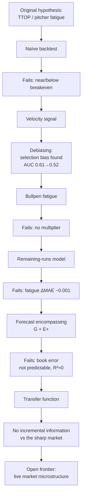

# Paper 1 — Outline & Draft Skeleton (v3)

**v3 changes (reviewer pass):** figures built + reordered (2→3 funnel→4 encompassing…); added
§5 *Research philosophy*; "negative result" language banned in favor of **boundary / constraint**;
Fig captions updated (formal graveyard name, "no incremental information" annotation, three-stage
debiasing, "one common slope", "approximately calibrated within this sample"); added a
pre-release three-reviewer protocol and a Discussion subsection protecting the methodological arc.

**Reframe (v2):** this is **not a betting paper** — it is an **empirical market-efficiency
paper**. Pitcher fatigue / TTOP is one *case study* within a general question. Every
section reflects that shift.

**Title (primary):** *From Pitcher Fatigue to Market Efficiency: An Empirical Evaluation
of Public Information in Live MLB Totals Markets*
**Alt:** *Do Public Baseball Variables Add Incremental Information Beyond Sharp Live
Betting Markets? Evidence from Escalating Validation Tests*
(Deliberately does **not** lead with "market efficiency"; the subtitle names the design.)

Status: historical phase complete. Prose drafted for anchor sections; language bound to
the experiment (claims are "no evidence of incremental information within our data," never
"the market is efficient").

---

## Three contributions (own BOXED section in the Introduction — visually distinct, numbered)

1. **Empirical.** For each public variable (TTOP, velocity, fatigue, bullpen, park, weather,
   pitch count) we ask *"does it survive conditioning on the market?"* — not merely *"does it
   predict runs?"* — via escalating tests culminating in forecast encompassing. Predicting runs ≠
   predicting book error.
2. **Methodological.** The escalating validation protocol (signal → robustness → out-of-sample →
   debiasing → conditional testing → forecast encompassing → transfer function) shifts the burden
   of proof from *prediction* to *incremental information beyond a market forecast*. Domain-general;
   transfers to NBA/NFL/soccer/tennis/racing.
3. **Infrastructure** (was "reproducibility" — it's bigger than that). The calibration engine,
   encompassing tests, remaining-runs model, transfer-function code, feature schema, and cleaned
   data, released as the **initial release of the Third Turn Benchmark** — a citable research
   artifact others evaluate new hypotheses against (cf. GLUE / ImageNet / MMLU / HELM in their
   fields), not just a reproducible appendix. *Modest verb: "we release," never "we introduce /
   establish." "v1.0" waits until the paper is public + revised once — version numbers imply a
   stability we're not at yet. Benchmark is documented BY Paper 1, not owned by it.*

## Two audiences (lean forecasting, not baseball, on every terminology fork)
(1) *Sports analytics* — TTOP, Statcast, betting. (2) *Applied statistics / forecasting* —
calibration, encompassing, incremental information, benchmark evaluation. Audience 2 is the larger
long-term readership; when a choice arises between baseball and forecasting terminology, choose
forecasting. Intro should **open with a live-betting statistic** (share of handle), not baseball —
baseball enters in paragraph two, so the paper reads broad from the first line.

---

## Abstract (draft, ~180 words)

Live in-play betting is now a majority of sports-wagering volume, yet market-efficiency
research concentrates on pregame moneylines; live totals and calibration remain little
studied, especially for baseball. We ask whether publicly observable baseball state
variables carry *incremental* predictive information about remaining runs beyond the live
total posted by a sharp market. Using 163 MLB games (June 2026) with one-minute live-odds
trajectories (Pinnacle-grade), pitch-level Statcast, and full play-by-play, we subject a
sequence of community hypotheses — times-through-order, velocity decline, bullpen fatigue,
drop reversion, alternate-line skew, early-run under-reaction, weather/park — to escalating
validation: out-of-sample cross-validation, selection-bias debiasing, context-controlled
conditioning, and finally a forecast-encompassing test against the market itself. No
variable survives. A game-state remaining-runs model is well-calibrated (R²≈0.22) but
fatigue terms change its error by <0.001 runs; the market's forecast error is not
predictable from any feature we measure (out-of-sample R²≈0). An event-level transfer
function shows the sharp line adjusts to information shocks by approximately the correct
magnitude. Within our data, we find no evidence of exploitable public-information
inefficiency, and we characterize the boundary precisely. We contribute a transferable
protocol for testing betting hypotheses and a reproducible benchmark.

---

## Figure 1 — the research process (the paper's spine; draft below)

*Start the paper with the process, not with baseball.*

## 1. Introduction
- Live/in-play betting dominates handle; efficiency research is pregame-centric. Live
  totals + calibration are under-studied.
- MLB as testbed: discrete events with established run values (RE24, linear weights),
  Statcast, and a strong community prior.
- **Reframe:** we evaluate *incremental information beyond a sharp market*, using TTOP as
  the entry case study. State the three contributions. Preview the **boundary result** —
  where publicly observable variables stop adding information beyond the market — + scope.
  *(Language rule for the whole manuscript: never "negative result." Frame findings as a
  **constraint / boundary** we identify, not a failure we report.)*

## 2. Related Work
TTOP as continuous familiarity (arXiv 2210.06724); relative-velocity ≈ 0.0006 wOBA/mph
(BP); betting-market overreaction/autocorrelation (Simon 2025); real-time inefficiency
(*Management Science* 2024); underreaction ~0.64:1 (arXiv 2606.07811). Gap: none combine
pitch-level state, live totals, calibration, and encompassing vs a sharp book.

## 3. Methods (DRAFTED — `draft_methods.md`; written as an experimental design, not a pipeline)
Organized around the research question, forecasting terms over baseball terms, **no subsection
named for a hypothesis** (TTOP/velocity are objects of study, not methods). Five subsections:
- **3.1 Data** — what exists, non-interpretive. 163 games / June 2026; one-minute Pinnacle-grade
  total trajectories; MLB Stats play-by-play + boxscore; pitch `startSpeed`; weather/venue;
  realized finals. Unit of analysis = the *half-inning snapshot*.
- **3.2 Feature construction** — how variables are built, no statistics yet. Defines the two
  forecasts compared: market remaining `B = live total − runs so far`, realized remaining
  `Y = final − runs so far`, so `Y−B` = the market's forecast error. State variables built without
  reference to outcome; `ΔRE = runs + ΔRE24`.
- **3.3 Validation protocol** — the ladder lives HERE (it is experimental design, not Results):
  Signal → Robustness → Out-of-sample → Debiasing → Conditional testing → Forecast encompassing →
  Transfer function. Carry a variable forward only until eliminated; report the rung of
  elimination. Guiding principle: *evaluate against the market, not merely against the outcome.*
- **3.4 Statistical evaluation** — the math: LOGO ridge encompassing (`Y~B`, `Y~X`, `Y~B+X`;
  direct `(Y−B)~X`; per-feature E+); calibration (reliability/Brier/ECE/AUC + Hanley–McNeil);
  transfer function (response ratio + common slope; linear-weights control); uncertainty
  (LOGO/Wilson/bootstrap). **Includes a one-paragraph "Why forecast encompassing?"** — ordinary
  accuracy can't separate *predicts outcome* from *adds info beyond an existing forecast*.
- **3.5 Reproducibility** — deterministic recompute from committed inputs; frozen `output/*.json`;
  release of datasets + protocol + reference models as the **initial release of the Third Turn
  Benchmark** under a DOI. Modest verb: "we release."

*Note:* the old standalone "Research philosophy" section is now redundant — its falsificationist
stance is split between Methods §3.3 (the ladder as design) and Discussion §7.4 (the burden-of-
proof philosophy). Do not reintroduce it as its own section.

## 6. Results (DRAFTED — `draft_results.md`; brief order: lead with the hardest evidence)
Ordered as a legal brief, not a chronicle. **One figure per paragraph**, opening from the
evidence. Sequence:
1. **Research Question** (one sentence) → "Figure 4 answers this question directly."
2. **Forecast encompassing (Fig. 4):** market R²=0.304 > features 0.279; combined ΔR²=−0.017;
   per-feature incremental ≤ +0.0018; book error not predictable OOS (R²=−0.037). Labeled in
   text as *the central empirical result of the study.*
3. **Hypothesis elimination (Fig. 2):** the boundary holds across the whole battery; the pattern
   of elimination (different gate per row) rules out a single artifact. Table → **Appendix A1**.
4. **Incremental-information funnel (Fig. 3):** 10 → 9 → 3 → 0 → 0; the empirical boundary.
5. **Velocity debiasing (Fig. 5):** 0.420 → 0.610 → 0.524; post-treatment selection, a general
   statistical principle.
6. **Transfer function (Fig. 6):** one common slope ≈0.74; uniform attenuation (measurement
   low-pass), not a per-event edge.
7. **Calibration (Fig. 7):** approximately calibrated within-sample; residual unpredictable;
   "together with Figure 4, defines the empirical boundary."
8. **Summary of Results:** one-paragraph bridge into the Discussion.

## 7. Discussion (DRAFTED — `draft_discussion.md`; an essay, not a longer Results)
Answers the four questions the Results avoid — *what it means, why it happened, why it matters
beyond baseball, what remains open* — and protects the methodological thread above all. Opens on
the research-question sentence (the spine).
- **7.1 What the boundary actually means.** Separate *prediction* from *incremental prediction*:
  the variables predict runs; conditioned on the market they add nothing (err R²=−0.037). Disarms
  the "but weather obviously matters" reviewer in advance. Mechanism: a sharp market already
  processes public state (transfer function moves proportionately ⇒ residual carries no signal).
- **7.2 Prediction is not profit (≈ a full page).** The manuscript's most portable sentence:
  *prediction and profit are distinct statistical problems.* Three independent links —
  prediction → increment → profit — most betting papers assume one arrow. Encompassing isolates
  the middle link.
- **7.3 The efficient frontier of public information.** Formalized (conceptually, not
  mathematically): the point at which added public variables stop improving prediction once the
  market forecast is conditioned upon. Every hypothesis was an attempt to move past it; none did.
- **7.4 The methodological contribution.** Escalating validation protocol; displayed ladder
  (Signal→Robustness→Out-of-sample→Debiasing→Conditional testing→Forecast encompassing→Transfer
  function); released as **The Third Turn Benchmark (v1.0)** + "the Third Turn validation
  protocol." The durable contribution — guard it above all.

## 8. Limitations (STANDALONE — reviewers look for this reflexively; audit tone, ~1 page)
Kept separate from Remaining Questions on purpose: a dedicated Limitations section signals
"weaknesses of our experiment" (and pre-empts limitations reviewers would otherwise invent),
whereas Remaining Questions signals "open science." Unemotional, itemized: scope (163 games /
one month / one sport); single Pinnacle-grade source at ~1-min cadence (cannot separate latency
from feed cadence); single-book benchmark (no cross-book test); market coverage (retail live team
totals, F5 untested); ground truth (static RE24/park values; pitching-change excluded from the
elasticity claim); estimation (LOGO; small n on rare events). None load-bearing for the central
result; each bounds generality.

## 9. Remaining Questions (NOT "Future Work" — what the evidence genuinely can't answer)
The *exciting* section: cross-book propagation/leadership + tradable laggard; distribution-shape
(σ/skew/tail) vs mean updating; information half-life per shock type; does the boundary move for
first-five-inning (starter-isolating) totals. Each is live-data-gated → Paper 2 microstructure.

## 10. Conclusion — "what we learned" (NOT a Future Work section)
The literary final paragraph: began as a search for an exploitable feature, ended by identifying
the empirical boundary; the boundary is itself the result; the contribution is a reproducible
framework for determining when an edge exists, not a betting strategy. (Verbatim in
`draft_discussion.md`.)

---

## Appendix Table A1 — every hypothesis, one page
*(Referenced once from Results; Figure 2 is the main-text representation — reviewers read the
graphic faster than the table.)*

| Hypothesis | Motivation | Test | Outcome | Why it failed |
|---|---|---|---|---|
| Times-through-order | Familiarity/fatigue penalty on 3rd time through | Binary gate → gradient, LOGO | Refuted | Decay is continuous, not a cliff; OOS fires −EV; market prices it |
| Velocity decline | Fatigue shows as lost mph | Debiased early-window vs post-treatment | Artifact | `vel_drop_13` defined only if starter survived to be shelled (selection); clean signal AUC≈0.52 |
| Bullpen fatigue | Gassed pen → higher scoring after a cliff | Isolated to the pen's own innings | Refuted | Gassed pens concede the same/fewer runs; no multiplier |
| Drop reversion (Over) | Over-dropped line reverts up | Threshold sweep, all games | Refuted | Reversion is right-skewed (win-big/lose-small); median below line |
| Drop reversion (Under) | Line stays low after a slow start | Banded + robustness gates | Not robust | Hot band moves with the snapshot inning; concentrated in recent sample |
| Alternate-line skew | Buy the fat upper tail at plus money | Empirical win% vs efficient-implied | Priced | Empirical < implied at every hook; tail priced fatter than realized |
| Early-run anchoring | Live total under-reacts to a 1st-inning explosion | Post-1st Over, cause split | Priced | 49/50 explosions hit-driven (no fluky pop); market prices the climb |
| Weather / park | Books under-price hitter-friendly context | Conditional split | Priced | Hitter-friendly Overs hit *less* (46%<50%): market over-adjusts |
| Remaining-runs fatigue | Fatigue adds to a state model | Incremental MAE, LOGO | Refuted | Game state already contains the info; ΔMAE −0.001 |
| **Forecast encompassing** | Does *anything* beat the market? | Y~B+X; (Y−B)~X; per-feature E+ | **Refuted** | Book error not predictable from any feature OOS (R²≈0) |

## Figures (BUILT — `make_figures.py` → `figures/*.png`; final order below)
The figures carry the argument before the prose does. **Order is deliberate:** the conceptual
story (2 → 3) precedes the statistics (4 →). The funnel now sits *immediately after* the
graveyard so the reader sees the shape of the result before any regression.

1. **Figure 1** — research-process flow (Mermaid, above). The spine.
2. **Figure 2 — Sequential elimination of candidate public-information hypotheses.**
   `hypothesis_elimination.png`. Manuscript caption uses the formal name; "hypothesis graveyard" is the
   talk/blog nickname only. Ten hypotheses × five escalating gates; green cleared / red failed /
   grey not reached; every row ends refuted.
3. **Figure 3 — The incremental-information funnel.** `incremental_information_funnel.png`. 10 → 9 → 3 → 0 → 0.
   Counts are derived from Fig 2's matrix so they can never drift. Placed here (not last) on the
   reviewer's advice: it states the conceptual result before the statistics open.
4. **Figure 4 — Forecast encompassing.** `forecast_encompassing.png`. Three forecasts +
   per-feature incremental R²; the combined bar is annotated **"no incremental information"**;
   near-zero features drawn neutral.
5. **Figure 5 — Velocity debiasing / post-treatment bias.** `velocity_post_treatment_bias.png`. Stages labeled
   **Baseline → Post-treatment → Debiased** (pedagogical: this is the figure non-baseball readers
   will cite). AUC 0.42 → 0.61 → 0.52 with Hanley–McNeil CIs; debiased CI straddles the coin flip.
6. **Figure 6 — Market transfer function.** `transfer_function.png`. ΔRE vs ΔBook by event; the
   headline is **one common slope** (≈0.74), not the 0.74 itself — every event lies on a single
   line ⇒ uniform attenuation (measurement low-pass), not a per-event edge.
7. **Figure 7 — Remaining-runs calibration.** `market_calibration.png`. Reliability curve +
   book-error histogram. Wording softened to **"approximately calibrated within this sample"**
   (no absolute "unbiased"). Appendix A hypothesis table travels with the figures.

*Typography/uncertainty:* one shared `figstyle` system; every estimate ships a CI
(Hanley–McNeil / bootstrap / SE bands); differences inside ±0.003 are neutral-colored so the
intervals, not the palette, carry the claim.

## Reproducibility & data availability
Release under a **Zenodo DOI**: cleaned trajectories, feature schema, calibration outputs;
link to the GitHub repo (code) and RESEARCH_LOG. Chain: Paper → GitHub → DOI → Data → Code
(maximizes citation + reproduction).

## Key references
arXiv 2210.06724 (TTOP); Simon (2025); *Management Science* (2024); arXiv 2606.07811;
Baseball Prospectus (relative velocity).

## Collaboration phases
Phase 1 — outline (**this doc, v3**). Phase 2 — draft Abstract→Discussion in prose.
Phase 3 — figures (**BUILT** — `make_figures.py`). Phase 4 — rigor/causal-language
edit ("associated with" vs "caused by"; confounders; claim support; no "negative result"
anywhere). *Reviewer-#2 pass by you throughout.*

## Pre-release review protocol (do NOT rush arXiv)
Before public release, hand the complete draft to **three readers with different lenses** —
a **statistician**, a **sports-analytics researcher**, and a **quantitative bettor** — and ask
each the *same single question*: **"Where does the paper overstate its conclusions?"** Fix only
those places, then release. This is deliberately narrow: the risk on a boundary/efficiency paper
is overclaiming, and three independent overclaim-hunters catch more than one generalist reviewer.
