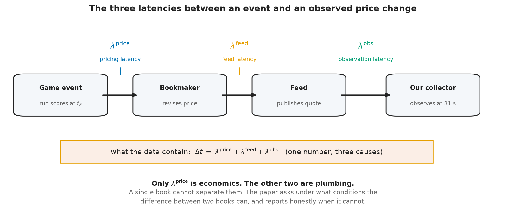
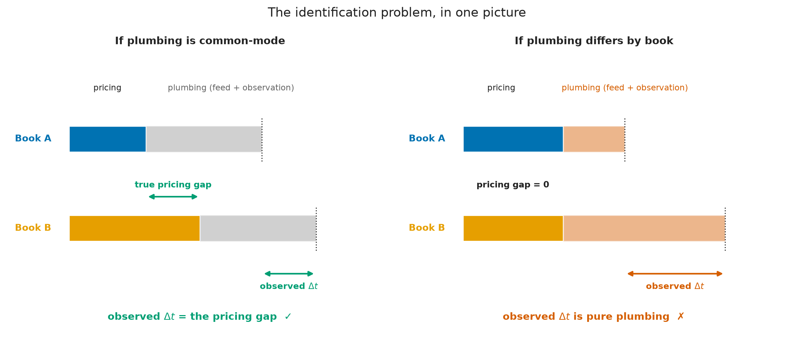

<h1>The Plumbing and the Price: Identifying Information Transmission in Live Betting Markets</h1>

A market that has already priced everything public must have priced it somehow. This paper asks whether the mechanism is observable, and is honest about when it is not.

Alec Messino The Third Turn Research Initiative &middot; alec.messino@gmail.com

Working Paper &middot; DRAFT, Sections 1-5 &middot; Results not yet written

> **Draft status.** This manuscript is complete through the Methods section. The Results and
> Discussion sections are deliberately unwritten: they are gated on four objective measurement
> conditions stated in Section 5.6, and the analysis plan in Section 5.5 is pre-registered so that
> the design cannot be shaped by the evidence. Nothing in the sections below reports an empirical
> finding from the dataset described in Section 4.

## Abstract

A companion study found that a live baseball wagering market encompasses every public-information
candidate tested against it: no variable in a ten-hypothesis ladder improved on the market's own
forecast of remaining runs. That null invites a mechanical question. If the market has already
incorporated public information, how does it do so, and does the process leave an observable trace?
We take up the transmission question directly. Using a two-book, thirty-one-second live quote panel
matched to game-state events, we define an event-anchored response latency for each bookmaker and
study the cross-book contrast. Our central contribution is not an estimate but an identification
analysis. We decompose the delay between a game event and an observed price change into three
components, only one of which is economic: bookmaker pricing latency, feed transport latency, and
observation latency imposed by our own sampling. We state the conditions under which the cross-book
contrast identifies the pricing component, show that several intuitive estimators of information
leadership are mechanically confounded by update frequency and by the analyst's choice of which
posted line to call the main line, and characterize the resolution floor below which this class of
instrument can say nothing. The paper is designed so that a demonstrated inability to separate
pricing from plumbing is a result rather than a failure.

---

## 1. Introduction

Market efficiency tests answer a question about outcomes. They ask whether some information, held by
someone, would have improved on the price. When the answer is no, as it frequently is, the finding is
usually reported and the matter closed. But a null of that kind is a statement about a mechanism
whose operation has not been observed. Something incorporated the information. The efficiency test
does not say what, or how quickly, or through which participant.

This paper begins where a companion study ended. That study treated a sharp live betting line as an
incumbent forecast of the runs remaining in a baseball game and asked whether any of ten publicly
observable candidates, pitcher fatigue and velocity decay among them, carried incremental predictive
content beyond it. None did. The market's forecast error was unpredictable from every variable
measured, and the one candidate that appeared alive was shown to be a post-treatment selection
artifact rather than an effect. The conclusion was a boundary: the frontier of public information had
already been reached by the price.

The natural next question is not whether the boundary exists but how it is enforced. A live betting
market is an unusually good laboratory for that question. Unlike an equity price, whose fundamental
value is never realized and whose information arrivals are diffuse and hard to timestamp, a baseball
market is punctuated by discrete, publicly observable, precisely dated events. A run scores. An out
is recorded. A pitcher is removed. Each is an information arrival with a known clock time, and each
is followed, sooner or later, by a revised price. The interval between the two is the object of this
paper.

Studying that interval requires more than one price. A single book's response time is not
interpretable on its own: it confounds how fast the bookmaker thinks with how fast its infrastructure
publishes and how fast the analyst happens to be looking. Comparing two books holds out the
possibility that the shared components cancel. Whether they actually do is an empirical and
architectural question, and answering it honestly is the substance of what follows.

We therefore frame this as a market microstructure paper rather than a second efficiency paper. The
question is not whether the market can be beaten. It is how information moves through a market that
apparently cannot be, and whether the movement is measurable with instruments of the kind available
to an outside observer. Three things follow from taking that question seriously.

First, the estimand must be defined before the data are examined, because the intuitive estimators
are wrong in a specific and instructive way. The obvious approach, timing one book's price change
against the other's, is mechanically biased toward whichever book updates more often. A book that
re-prices every thirty seconds will reach any given price level before a book that re-prices every
eight minutes, regardless of which one is better informed. That is not leadership; it is sampling.

Second, the identification problem must be confronted rather than assumed away. The delay we observe
is a sum of three delays, and only one of them is about pricing. Separating them requires either an
independent measurement of transport latency or an argument that transport latency is common across
books. Neither is free, and we do not assume either.

Third, the instrument's limits must be stated in advance. A panel sampled every thirty-one seconds
cannot resolve sub-second price formation. If the economically interesting action happens below the
sampling floor, no amount of care in the analysis will recover it, and the honest report is that the
question is out of reach for this apparatus.

The paper is organized around those three commitments. Section 2 develops the conceptual framework
and decomposes the observed delay. Section 3, the heart of the paper, treats identification: what can
and cannot be learned from a two-book panel, and under exactly which assumptions. Section 4 describes
the data and explains why this instrument differs fundamentally from the one used in the companion
study, a difference that precludes any direct comparison of results. Section 5 states the estimation
procedure and the pre-registered analysis plan, and closes by listing the objective conditions that
must be satisfied before results may be reported.

---

## 2. Conceptual framework

### 2.1 The transmission chain

Consider a discrete, publicly observable event in a baseball game occurring at clock time
`t_E`: a run scores. The event changes the conditional distribution of the game's final total, and a
bookmaker offering a live total on that game will, at some point, revise its posted number. An
outside observer records the revision at some later time. Between the event and the record lie three
distinct delays, produced by three distinct mechanisms.

**Figure 1.** The chain from event to observation. A run scores; the bookmaker revises its price;
the feed publishes the revision; our collector samples the feed. Each arrow carries its own delay,
and the data contain only their sum. Only the first is a statement about the market.

**Pricing latency**, which we write as the interval between the event and the bookmaker's internal
decision to revise, is the economically meaningful quantity. It reflects how quickly the bookmaker
detects the event, updates its model, and commits to a new number. Differences in pricing latency
across books are differences in how the market processes information.

**Feed latency** is the interval between the bookmaker's internal revision and the moment that
revision becomes visible on the public endpoint we query. It is a property of publishing
infrastructure, caching, and content delivery, not of judgment about baseball.

**Observation latency** is the interval between publication and our sampling of it. It is a property
of our own collector. With a polling interval of roughly thirty-one seconds, a revision published
immediately after a poll waits, on average, about fifteen seconds to be seen, and up to
thirty-one seconds in the worst case.

The data contain only the sum. For book `b` and event `E`, the observable is

> `Δt_b(E) = λ_price_b(E) + λ_feed_b(E) + λ_obs_b(E)`

and no manipulation of a single book's series decomposes it. This is the paper's governing
difficulty, and it is why the identification section is longer than the estimation section.

### 2.2 Why two books might help

If the second and third terms were identical across books, the cross-book difference would remove
them:

> `Δt_A(E) - Δt_B(E) = λ_price_A(E) - λ_price_B(E)`

and the contrast would isolate the economics. This is the hope that motivates a two-book design, and
it is an assumption, not a fact.

**Figure 2.** The identification problem. On the left, the transport components are equal across
books, so the observed difference in response time equals the true difference in pricing speed. On
the right, the pricing speeds are identical and the entire observed difference is an artifact of
unequal publishing infrastructure. Both panels are consistent with the same observed data. Telling
them apart requires evidence external to the timing series itself.

Observation latency is plausibly common-mode by construction: a single collector polls both books on
the same schedule, so the sampling penalty is drawn from the same distribution for each. Feed latency
is not. Two commercial sportsbooks run different infrastructure, and there is no reason in principle
for their publishing delays to match. Whether the difference is material relative to the pricing
differences we hope to detect is precisely what Section 3 must establish.

### 2.3 Why the estimand is anchored to the event

A tempting alternative avoids the event entirely: observe when each book arrives at a given price
level and call the earlier one the leader. This is mechanically defective.

**Figure 3.** Left: a book that re-prices frequently passes through any given price level before a
book that re-prices rarely, purely as a consequence of update density. A leadership statistic built
on book-to-book arrival times reports this sampling artifact as information leadership. Right:
anchoring each book's response to the exogenous game event measures each against a clock that neither
book controls, so update density no longer confers a spurious advantage.

The game event is exogenous to both books in the relevant sense: runs are not caused by bookmaker
quoting behavior. Anchoring to it converts a comparison between two endogenous, differently sampled
series into two comparisons against a common external clock. This does not solve the feed-latency
problem, but it removes the frequency confound, which is a distinct and more easily made error.

### 2.4 What the market is quoting

One structural fact about the instrument shapes the analysis and is easy to get wrong. The posted
live number is a **full-game total**, not a forecast of remaining runs: it is the expected final
combined score, incorporating runs already scored. Consequently a run that scores enters the posted
number with a positive sign, partially offset by the reduction in scoring opportunities that remain.
A revision following a run is therefore expected to be upward, and its magnitude is a pass-through
fraction rather than an elasticity. We verify this property directly in Section 4 rather than
assuming it, because the opposite convention would reverse the sign of every response we measure.

---

## 3. Identification

This section is the paper's core contribution. We state the assumptions under which the cross-book
contrast identifies a pricing difference, examine each against what is known about the instrument,
and describe what remains estimable when an assumption fails.

### 3.1 The estimand

Let `E` index discrete game events with clock times `t_E`, and let `t_b(E)` denote the time of book
`b`'s first main-line revision attributable to `E`. Define the event-anchored response latency

> `λ_b = E[ t_b(E) - t_E ]`

and the cross-book contrast `Δλ = λ_A - λ_B`. The target of inference is `Δλ`, and the question the
paper asks is under what conditions `Δλ` is a statement about pricing rather than about plumbing.

### 3.2 The assumptions

**A1. Event exogeneity.** Game events are not caused by bookmaker quoting behavior. This is
uncontroversial in this setting and is the reason event anchoring is available to us at all.

**A2. Clock comparability.** Event timestamps and quote timestamps are on a common, comparable
clock. This is not automatic. Event times are derived from one upstream provider and quote times from
another, and either may be a publication time rather than an occurrence time. A2 requires a direct
audit of timestamp provenance, and any residual skew must be quantified rather than assumed away,
because a constant skew shifts both `λ_A` and `λ_B` equally but a book-specific skew is
indistinguishable from a pricing difference.

**A3. A well-defined main line.** The response `t_b(E)` presupposes a single price series per book.
Books post multiple simultaneous total lines, a main line and alternates, without a discriminator.
Reasonable rules for extracting the main line disagree with one another on a large majority of
observations, and downstream statistics move materially depending on the choice. A3 therefore
requires a fixed, documented, and tested extraction rule, together with a demonstration that the
conclusions do not depend on it.

**A4. Separability of transport from pricing.** This is the binding assumption. `Δλ` identifies the
pricing contrast only if feed latency is common-mode across books, or if a book-specific transport
component can be independently measured and removed. We do not assume A4 holds. Establishing whether
it holds, or demonstrating rigorously that it cannot be established with instruments of this class,
is the paper's principal empirical task.

**A5. Sufficiency of two books.** With two books, a discrepancy is detectable but not attributable:
if one book behaves anomalously there is no third observation to adjudicate which is anomalous. A5
therefore concerns robustness rather than point identification, and it is either satisfied by adding
a third live source or addressed by an explicit outlier-detection procedure that does not require
one.

**A6. Non-arbitrary attribution.** The mapping from an event to "the revision caused by it" requires
an attribution window. A window chosen after inspecting the data is a researcher degree of freedom
capable of manufacturing an effect. A6 is satisfied by pre-registration, which is why the window is
fixed in Section 5.5 before any estimate is produced.

### 3.3 What is identified under failure

The paper is designed so that assumption failures yield reportable results rather than a dead end.

If A4 fails and transport latency is book-specific and unmeasurable, `Δλ` is not a pricing quantity
and no leadership claim is licensed. The reportable result is then a bound: a demonstration that a
class of publicly available instruments, however carefully applied, cannot separate market behavior
from publishing infrastructure, together with a specification of what additional measurement would be
required. This is a genuine contribution to the microstructure literature, which has generally
enjoyed exchange-timestamped data and has not had to confront this decomposition explicitly.

If A3 fails and results depend on the extraction rule, the reportable result is a sensitivity
analysis quantifying how much of an apparent leadership finding is attributable to an analyst's
choice. Given that reasonable rules disagree on most observations, this quantity is of independent
methodological interest.

If A5 fails, point estimates survive but robustness claims weaken, and the paper reports the
estimates with an explicit statement that single-book anomalies cannot be excluded.

### 3.4 The resolution floor

An instrument cannot report structure below its sampling interval.

**Figure 4.** The instrument's resolution. With a thirty-one-second polling interval, latency
differences below that scale are not recoverable, and this paper makes no claim about them. Delays at
the scale of a bookmaker noticing a run and revising a number, plausibly seconds to minutes, sit
above the floor and are within reach. The figure is a statement about the apparatus, not about the
market.

This limit is worth stating plainly because it bounds the paper's ambition. Financial microstructure
research often concerns latencies measured in microseconds. Nothing in this design speaks to that
regime. What it can speak to is the slower, human-and-model-mediated process by which a sportsbook
absorbs a publicly visible event, and whether two such processes can be distinguished from outside.

---

## 4. Data and institutional setting

### 4.1 The instrument

The data are generated by a continuously running collector that polls two sportsbooks and a
game-state provider on a fixed schedule and appends every observation to an append-only panel. The
properties below are verifiable facts about the apparatus rather than findings, and we state them as
such.

| Property | Value |
|---|---|
| Sampling cadence (live) | approximately 31 seconds, median, both books |
| Books observed | two, both retail-facing |
| Games with live quotes | in excess of one hundred, accumulating |
| Quote fields | posted line, both sides' prices, live flag, market status |
| Market status coverage | one book only |
| Game state | inning, half, outs, base occupancy, score, pitch count, times through order |
| Line semantics | full-game total, verified against pregame distribution |

### 4.2 What this instrument does not contain

Three absences are load-bearing for interpretation and are properties of the design rather than
accidents of a particular sample.

There is **no sharp benchmark book**. Both observed books are retail-facing. The companion study used
a sharp book as its incumbent forecast; nothing in this panel plays that role, and the leadership
question here is therefore about two retail books rather than about a sharp-to-retail information
cascade.

There are **no pitch-level or meteorological covariates**. The companion study's feature set is
unavailable here.

**Market status is asymmetric**. One book publishes an explicit open, suspended, or removed state;
the other publishes nothing. Any analysis that filters on tradeability can therefore only be applied
to one book, and applying it to one and not the other introduces selection that favors the filtered
book.

### 4.3 Why no comparison with the companion study is possible

It is tempting to treat this dataset as a second sample of the companion study's population. It is
not. The two differ in the benchmark book, in the available covariates, and in the sampling cadence.
Any difference in results between them would be jointly attributable to the passage of time and to
the change of instrument, with no way to apportion between the two. We therefore make no claim in
either direction about the companion study's conclusions. A temporal replication of that study
requires re-running its own instrument, and is a separate exercise reported elsewhere.

---

## 5. Methods

### 5.1 Constructing the event series

Events are extracted from the game-state panel as changes in the combined score between consecutive
observations. The event time is the timestamp of the first observation exhibiting the new score,
which is itself subject to the provider's own publication delay; A2 concerns exactly this, and the
audit described in Section 5.6 quantifies it. Events are typed by magnitude, since a solo home run
and a bases-clearing double are different information arrivals.

### 5.2 Constructing the price series

For each book, the main line is extracted per observation timestamp under a single fixed rule, and
the series is reduced to the sequence of distinct quote states. Repeated identical quotes are not
revisions and are collapsed. The extraction rule is fixed in advance, and the sensitivity of every
reported quantity to that choice is reported alongside it, per A3.

### 5.3 Attribution

A revision is attributed to an event if it is the first distinct main-line change occurring within a
fixed post-event window. The window is stated in the pre-registered plan below. Events whose windows
overlap a subsequent event are flagged and analyzed separately, since attribution is ambiguous when
two information arrivals are closer together than the response time being measured.

### 5.4 Estimation and inference

The unit of replication is the game, not the observation. Quotes within a game are strongly
dependent, and treating them as independent produces intervals that are far too narrow. All
estimation therefore proceeds by computing a per-game statistic and treating the game as the
sampling unit, with intervals constructed accordingly.

### 5.5 Pre-registered analysis plan

The following is fixed before any estimate is computed. Departures from it will be reported as
departures.

1. **Primary estimand.** The cross-book contrast in event-anchored response latency, `Δλ`.
2. **Event definition.** A change in combined score, typed by magnitude.
3. **Attribution window.** Three hundred seconds after the event. Events with a subsequent event
   inside the window are analyzed as a separate, flagged stratum.
4. **Main-line extraction.** A single odds-anchored rule, fixed and documented, with a mandatory
   sensitivity analysis across at least two alternative rules.
5. **Unit of replication.** The game.
6. **Primary comparison.** Direction and magnitude of `Δλ`, reported with a game-clustered interval.
7. **Mandatory falsification tests.** Before any leadership interpretation is offered: a
   symmetry test comparing the frequency of pre-event and post-event revisions, which separates a
   genuine response from a book's baseline revision rate; a shuffled-event placebo; and the
   extraction sensitivity analysis of item 4.
8. **Reporting rule.** A null result is reported with the same prominence as a positive one. No
   estimand, window, or extraction rule is added or altered after inspecting the results.

### 5.6 Conditions required before results may be reported

The Results section of this paper remains unwritten until all four of the following hold, each
verified and recorded:

1. **A well-defined main line.** An extraction rule fixed in code and tested, with a demonstration
   that the primary statistic is materially invariant to reasonable alternatives.
2. **Clock comparability.** An audit establishing that event and quote timestamps are comparable,
   with residual skew quantified.
3. **Transport separability resolved in one direction.** Either an independent measurement of
   book-specific feed latency, or a defended argument that it is common-mode, or a documented
   demonstration that neither is achievable with this class of instrument. The third outcome
   satisfies this condition and converts the paper into a pure identification result.
4. **Robustness support.** A third live source, or an explicit outlier-detection procedure that does
   not require one.

Stating these in advance is the point. A paper that fixes its design before seeing its evidence
cannot be reshaped by the evidence, and a null that arrives under those conditions carries the same
weight as a finding.

---

*Sections 6 (Results) and 7 (Discussion) are intentionally not drafted. See Section 5.6.*
