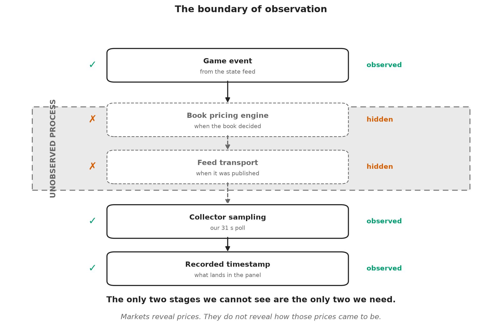
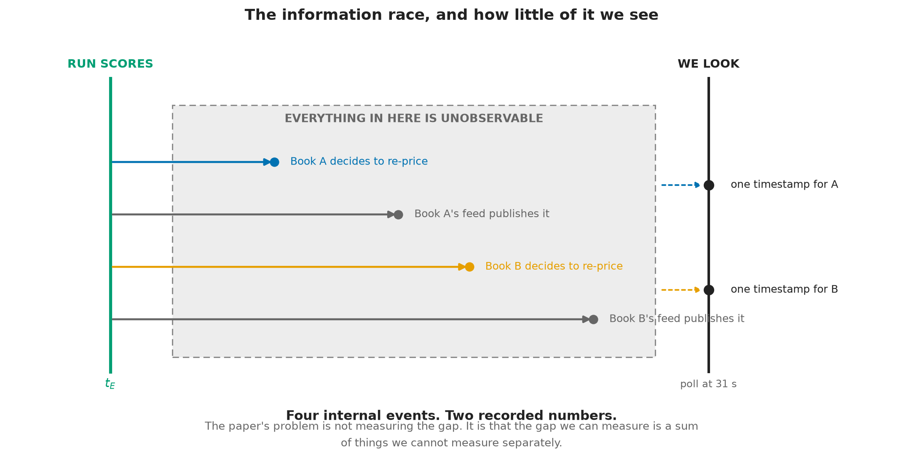
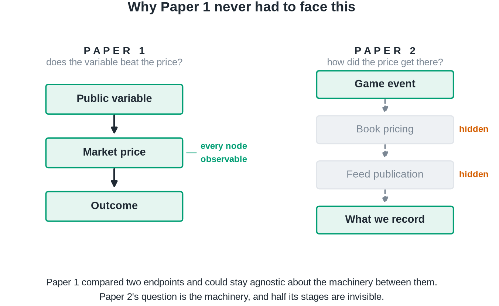
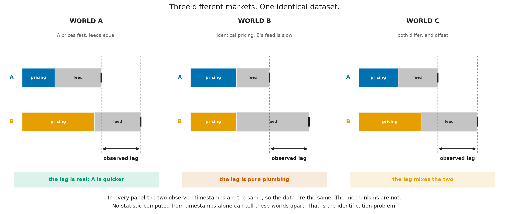
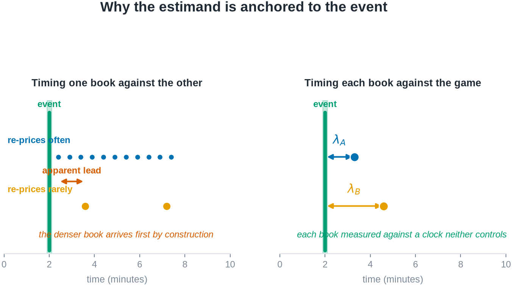
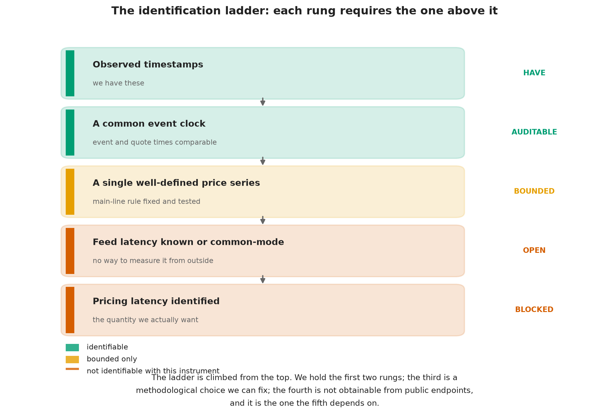
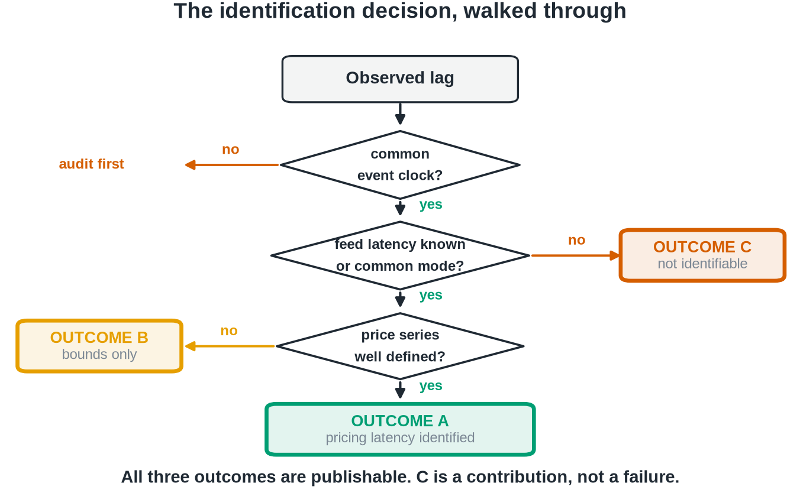
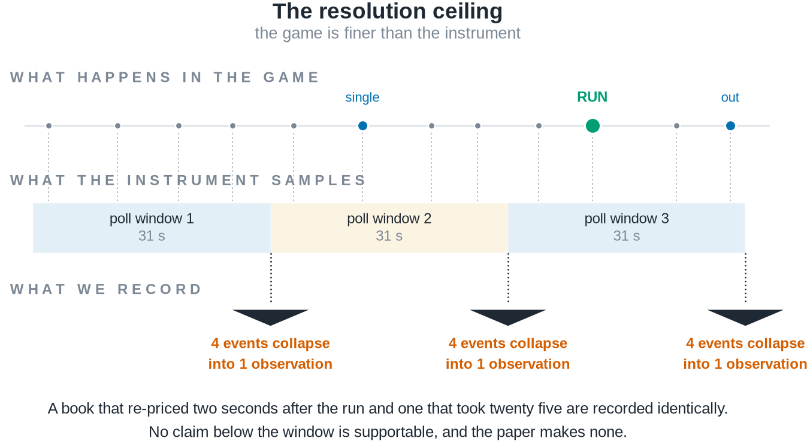
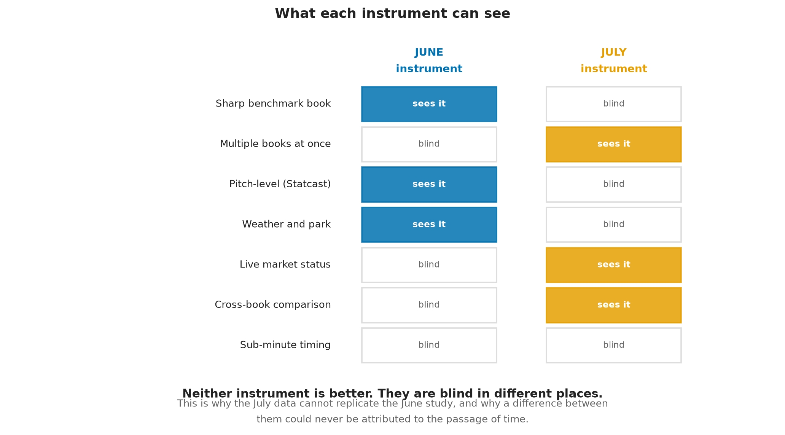
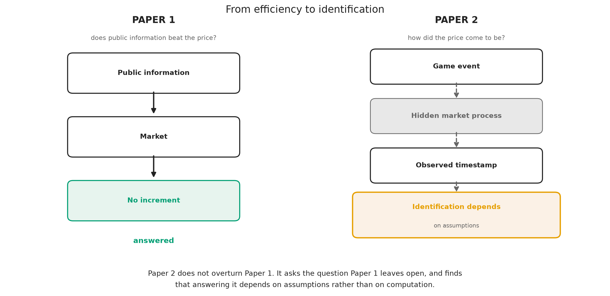

<h1>What Prices Cannot Tell You: Identifying Information Transmission in Live Markets</h1>

A companion study asked whether prices contain public information. This paper asks whether prices reveal how that information entered the market.

Alec Messino The Third Turn Research Initiative &middot; alec.messino@gmail.com

Working Paper &middot; DRAFT, Sections 1-6 &middot; Gate applied: Outcome C &middot; Results not yet written

> **Draft status.** This manuscript is complete through the Methods section. The analysis plan in
> Section 6.5 is pre-registered, and Section 6.6 fixes four conditions that gate what may be
> reported. Those conditions have now been applied to the evidence. **The outcome is C: the pricing
> contrast is not identifiable with this class of instrument.** Condition 3 is satisfied by its
> documented-impossibility route; Conditions 1, 2 and 4 are **not** satisfied and are reported as
> failing throughout. Section 6.6 carries a dated amendment, made after the evidence was seen, that
> scopes those three conditions to estimate-reporting only — it does not deem them met. **No
> numerical estimate of the pricing contrast is reported anywhere in this paper**, and under the
> amendment's tripwire none may be until those conditions are satisfied in their original form.

## Abstract

A companion study found that a live baseball wagering market encompasses every public-information
candidate tested against it: no variable in a ten-hypothesis ladder improved on the market's own
forecast of remaining runs. That null is a statement about outcomes, and it invites a question about
mechanism. The companion study asked whether prices *contain* public information; this paper asks
whether prices *reveal how that information entered the market*. Information in prices and formation
of prices are distinct questions, and the second does not follow from the first by adding data.

We take up the transmission question directly, and find that it is largely an identification problem.
The delay between a game event and an observed price change decomposes into a bookmaker's pricing
latency, its feed's publication latency, the staleness of the copy its distribution path delivers to
us, and the sampling delay imposed by our own cadence. That decomposition is arithmetic. Only the
last of the four is common-mode across books, and we measure the third rather than assume it away.
The substantive difficulty is that only their sum is observed, and this paper is about what can and
cannot be learned under that constraint. We show that three materially
different markets, one in which a bookmaker genuinely prices faster, one in which pricing speeds are
identical and only publishing infrastructure differs, and one in which both differ and partially
offset, generate numerically identical timestamp data. No statistic computed from timestamps alone
separates them.

Working from a two-book, thirty-one-second live quote panel matched to game-state events, we define
an event-anchored response latency and state precisely the conditions under which its cross-book
contrast is a statement about pricing rather than about plumbing. We show that several intuitive
estimators of information leadership are mechanically confounded by update frequency and by the
analyst's choice of which posted line to treat as the main line, and we characterize the resolution
floor below which this class of instrument is silent. The design admits three outcomes, all of which
we regard as publishable: identification of a pricing contrast, identification of bounds only, or a
demonstration that the quantity is not identifiable without richer instrumentation. The price
discovery literature answers our question directly where venue timestamps and order identifiers are
available, because there the publication stage is pinned by the data rather than estimated; the
contribution here is to characterize what remains learnable when it is not. The third is not
a failure of the study. Much of the microstructure literature studies environments in which richer
event and timestamp information is available than sportsbook endpoints provide, so the decomposition
we confront can often be assumed away there rather than established. Showing precisely where it
cannot be assumed away is itself a contribution.

---

## 1. Introduction

Every pitch thrown in a Major League Baseball game can trigger dozens of price updates across
sportsbooks before the next pitch is delivered. These are high-frequency markets in the ordinary
sense, with one property that makes them an unusually clean laboratory for studying price formation:
every contract settles within hours against an objective terminal payoff, so the quantity being
forecast is eventually revealed and the forecast can be graded. Equity prices offer no such closure.

Market efficiency tests answer a question about outcomes. They ask whether some information, held by
someone, would have improved on the price. When the answer is no, as it frequently is, the finding is
reported and the matter closed. But a null of that kind is a statement about a mechanism whose
operation was never observed. Something incorporated the information. The efficiency test does not
say what, or how quickly, or through which participant.

This paper begins where a companion study ended. That study treated a sharp live betting line as an
incumbent forecast of the runs remaining in a baseball game and asked whether any of ten publicly
observable candidates, pitcher fatigue and velocity decay among them, carried incremental predictive
content beyond it. None did, and the one candidate that appeared alive proved to be a post-treatment
selection artifact.

The two studies stand in a natural progression rather than a sequence of increments. **Paper 1 asked
whether prices contain public information. This paper asks whether prices reveal how that
information entered the market.** The first is a question about the content of a price; the second is
a question about its formation, and the two are answered with different instruments and different
assumptions. The transition can be stated more precisely still. **The
companion study established that public baseball variables contain no incremental information beyond
a sharp market observed at one-minute resolution; this paper asks whether that apparent efficiency is
genuine, or whether it is partly an artifact of observing the market only after the information has
already propagated through it.** The companion study's closing section anticipates the question,
listing cross-book propagation, the information half-life of a shock, and the microstructure limits
of one-minute single-book snapshots among the things its data could not settle.

The obstacle is not statistical power. It is that the process of interest is unobserved. A baseball
market is punctuated by discrete, publicly dated events, and each is followed, sooner or later, by a
revised price; but between the event and the revision we record sit stages that no outside observer
sees.

**Figure 1.** *We never observe the pricing process itself.* Of the five stages between a game event
and a row in our dataset, the two in the shaded band are exactly the two the question is about: when
the bookmaker decided to move, and when its feed made that decision visible. Everything we record
sits below the boundary.

Box 1 makes the difficulty concrete before any notation is introduced.

Box 1. A thought experiment

Two sportsbooks are quoting the same game. A run scores. Book A updates its price 800
milliseconds later; Book B updates 1.6 seconds later. You observe both prices once every 30 seconds.

Can you conclude that Book A processes information faster?

<strong>No.</strong> You did not observe the pricing engines, the feed delays, or the moment the
event actually occurred. You observed two timestamps, produced by a sampling process of your own
construction, at a resolution nearly twenty times coarser than the difference you are trying to
detect. Both books land in the same poll. The data are silent.

This paper is about what it takes to make them speak, and about being candid when they cannot.

The problem has a familiar shape. Astronomers infer the mass of a planet they cannot see from the
wobble of a star they can, and the inference is only as good as the model of what lies between the
observer and the object; much of the work is characterizing the instrument rather than the sky. Our
position is the same. **Markets reveal prices. They do not reveal how those prices came to be.**

Two prices are therefore the minimum. A single book's response time confounds how fast the bookmaker
reprices with how fast its infrastructure publishes and how fast the analyst happens to be sampling.
Comparing two books raises the possibility that the shared components difference out. Whether they
actually do is an architectural question about publishing infrastructure, not a statistical one, and
it is the question on which the paper's central estimand stands or falls. Section 4 shows that three
materially different markets generate numerically identical timestamp data, so the possibility cannot
be settled by any statistic computed from the timestamps themselves; that result, illustrated in
Figure 4, is the paper's core.

We frame this accordingly as a paper about identification in high-frequency markets, not as a second
efficiency paper and not as a paper about sportsbooks. Sports betting is the laboratory, chosen
because its information arrivals are discrete and precisely dated and its contracts settle against
ground truth. The identification problem it exposes is general. Three consequences follow.

First, the estimand must be defined before the data are examined, because the intuitive estimators
are wrong in a specific and instructive way. The obvious approach, timing one book's price change
against the other's, is mechanically biased toward whichever book updates more often. A book that
re-prices every thirty seconds will reach any given price level before a book that re-prices every
eight minutes, regardless of which one is better informed. That is not leadership; it is sampling.

Second, the identification problem must be confronted rather than assumed away. The delay we observe
is a sum of three delays, and only one of them is about pricing. Separating them requires either an
independent measurement of transport latency or an argument that transport latency is common across
books. Neither is free, and we do not assume either.

Third, the instrument's limits must be stated in advance. A panel sampled every thirty-one seconds
cannot resolve sub-second price formation. If the economically interesting action happens below the
sampling floor, no amount of care in the analysis will recover it, and the honest report is that the
question is out of reach for this apparatus.

The paper is organized around those three commitments. Section 2 places the study against the
literatures on market efficiency, price discovery, and cross-market timing, and states precisely
which instrumentation those literatures rely on and we lack. Section 3 develops the conceptual
framework and decomposes the observed delay. Section 4, the heart of the paper, treats
identification: what can and cannot be learned from a two-book panel, and under exactly which
assumptions. Section 5 describes the data and explains why this instrument differs fundamentally
from the one used in the companion study, a difference that precludes any direct comparison of
results. Section 6 states the estimation procedure and the pre-registered analysis plan, and closes
by listing the objective conditions that must be satisfied before results may be reported.
Section 7 states the scope of the contribution.

---

## 2. Related literature and the identification gap

A referee's first question about a paper like this is why the problem has not already been solved.
The answer is not that the literatures below overlooked it. It is that in the settings where price
discovery has been studied most carefully, the instrumentation available to the researcher resolves
the problem by construction, and the question therefore never has to be posed. We organize this
section around what each literature identifies, what data it identifies it with, and what happens to
the argument when those data are unavailable.

### 2.1 What prices contain

The efficiency literature asks whether prices already embody available information. Fama (1970) sets
the frame; the event-study tradition sharpened it to the speed of adjustment, with Patell and Wolfson
(1984) measuring intraday adjustment to earnings and dividend announcements and Busse and Green
(2002) tracking incorporation of televised analyst reports in real time. In wagering markets the
same question has an unusually clean form because contracts settle against ground truth: Sauer
(1998) surveys the evidence, Woodland and Woodland (1994) document a reverse favorite-longshot bias
in baseball too small to exploit, and Thaler and Ziemba (1988) place the setting in the anomalies
tradition. Croxson and Reade (2014) show soccer exchange prices updating swiftly and essentially
fully on goal arrivals. More recent work finds imperfections in the price process itself: Simon
(2024, 2025) rejects weak-form efficiency in moneyline movement, and Angelini and De Angelis (2026)
measure contemporaneous underreaction to benchmark probability changes with predictable subsequent
drift.

These studies identify a property of the price. None of them requires knowing *when the bookmaker or
the exchange internally decided to move*, because the object of inference is the price level and its
relation to information, not the timing of the mechanism that produced it. Our companion study sits
squarely here: it applies the forecast encompassing framework of Chong and Hendry (1986) to a live
betting line treated as an incumbent forecast, and its null is a statement of the same type.

### 2.2 How information enters prices

The price discovery literature asks where a common efficient price is formed when the same asset
trades in several venues. Hasbrouck's (1995) information shares and the Gonzalo and Granger (1995)
permanent-transitory decomposition are the standard tools, and Putniņš (2013) offers a careful
account of what those metrics do and do not measure. This literature is the closest ancestor of the
present paper: it asks precisely our question, which venue moves first and why.

Its instrumentation is what makes it work. Information shares are estimated on venue-level quote and
trade series carrying exchange-side timestamps, applied to a common clock, at a granularity fine
relative to the leads being estimated. The publication stage is not a nuisance term to be estimated
because it is pinned directly by the venue's own timestamp. Where that is unavailable, the metric
does not become noisier; it becomes a different quantity.

### 2.3 Timing across markets

A related tradition estimates leads and lags directly. Hasbrouck (1991) recovers the information
content of trades from a bivariate vector autoregression; Chan (1992) analyzes the lead-lag relation
between index futures and the cash market. Later work pushes to the latency frontier: Hasbrouck and
Saar (2013) identify low-latency strategic activity using millisecond-stamped order-level messages,
and Budish, Cramton, and Shim (2015) analyze the speed race itself using synchronized data on
correlated instruments.

Two features of these designs deserve emphasis, because their absence defines our problem. First,
order-level identifiers let the researcher follow an individual message rather than infer activity
from a price series. Second, the timestamps are applied at the venue, so transport to the researcher
does not enter the estimand. Ding, Hanna, and Hendershott (2014) make the second point especially
clearly: they compare the consolidated feed with direct exchange feeds and quantify the dissemination
latency between them, which is possible precisely because both feeds are observable. Their result is
the strongest evidence we know of that transport latency is economically material rather than a
rounding error, and it is also a demonstration that measuring it requires holding the two feeds side
by side.

### 2.4 The observational setting of this study

Public sportsbook endpoints supply none of that instrumentation. There are no order-level
identifiers, because there is no order book to observe; a bookmaker posts a price rather than
matching a queue. There is no venue-side timestamp on the price change, only the time at which our
own poll retrieved it. There is no second feed from the same book against which dissemination could
be differenced, as Ding, Hanna, and Hendershott could difference the consolidated and direct feeds.
And the sampling interval is set by the researcher's own polling rather than by the venue's
messaging.

The consequence is not that estimation becomes harder. It is that the estimand changes. In the price
discovery setting the object of inference is a property of the market, and the apparatus is
transparent. Here the apparatus enters the estimand, and the observed quantity is a sum of a market
component and two infrastructure components that no amount of additional sampling separates. That is
the gap this paper occupies.

### 2.5 Where this paper sits

The relevant methodological literature is therefore not price discovery but identification. Manski
(2003) and Tamer (2010) develop the position we adopt: when a parameter is not point-identified by
the available data, the disciplined response is to characterize what the data do support, report
bounds where bounds exist, and state the additional information that would restore identification.
Applied to transmission, that means treating a latency estimate as a joint statement about a market
and about the instrument that observed it, and refusing to report the first without defending the
second.

**The present paper is motivated not by disagreement with these literatures, but by a different
observational setting.** Where venue timestamps and order identifiers are available, the questions of
Sections 2.2 and 2.3 are answerable as posed and our concerns do not arise. Where they are not, an
estimate that would be unremarkable in those settings becomes an inference resting on an unstated
assumption about publishing infrastructure. We take the second case seriously because it is the case
most outside researchers actually face, and because sportsbook markets make it possible to state the
problem precisely rather than in the abstract.

This positioning has a consequence we want to be explicit about. **The contribution stated here does
not depend on the sign or significance of any latency estimate we eventually report.** If every
estimate proves null, the paper still establishes what a public-endpoint observer can and cannot
learn about price formation, which assumptions would have to hold for a leadership claim to be
warranted, and what instrumentation a subsequent study would need to build. The identification
problem, not the baseball application, is the durable object.

---

## 3. Conceptual framework

### 3.1 The transmission chain

Consider a discrete, publicly observable event in a baseball game occurring at clock time
`t_E`: a run scores. The event changes the conditional distribution of the game's final total, and a
bookmaker offering a live total on that game will, at some point, revise its posted number. An
outside observer records the revision at some later time. Between the event and the record lie three
distinct delays, produced by three distinct mechanisms.

**Pricing latency**, which we write as the interval between the event and the bookmaker's internal
decision to revise, is the economically meaningful quantity. It reflects how quickly the bookmaker
detects the event, updates its model, and commits to a new number. Differences in pricing latency
across books are differences in how the market processes information.

**Feed latency** is the interval between the bookmaker's internal revision and the moment that
revision becomes visible on the public endpoint we query. It is a property of publishing
infrastructure, caching, and content delivery, not of judgment about baseball.

The interval between publication and our record is where an earlier version of this paper was
imprecise, and the imprecision mattered. It is tempting to call the remainder "observation latency"
and treat it as a single delay belonging to our collector. It is two delays belonging to two
different parties, and only one of them is ours.

**Delivery staleness** is the interval between a revision becoming available at the bookmaker's
origin and the copy of it that our request actually receives. Public sportsbook endpoints sit behind
content-delivery networks, so a response can be assembled from an object generated some time ago.
This is a property of the book's distribution path, not of our cadence, and Section 5 reports it as
measured rather than assumed: it is large, book-specific, and the two books do not even describe it
under the same convention.

**Collector sampling delay** is the interval between the moment a revision is retrievable by us and
the moment we retrieve it. This one genuinely is a property of our own instrument. With a polling
interval of roughly thirty-one seconds, a revision that becomes retrievable immediately after a poll
waits, on average, about fifteen seconds to be seen, and up to thirty-one seconds in the worst case.
Because a single collector polls both books on one schedule, this term — and only this term — is
common-mode by construction.

**Figure 2.** *Four internal events; two recorded numbers.* Each book decides to re-price and
each book's feed publishes that decision. None of the four is visible. What we hold is one
timestamp per book, and the interval we can measure is a sum of intervals we cannot measure
separately.

**Figure 3.** *Paper 1 never needed to identify internal latency.* It compared two endpoints, a
public variable and a realized outcome, with the market price between them, and every node it
required was observable. This paper's question is the machinery itself, and two of its four
stages are hidden from any outside observer.

The data contain only the sum. For book `b` and event `E`, the observed arrival delay is

> `Δt_b(E) = λ_price_b(E) + λ_feed_b(E) + λ_deliv_b(E) + λ_samp(E)`

with the terms carrying deliberately unequal status:

| Term | What it is | Status in this study |
|---|---|---|
| `λ_price_b` | the bookmaker's internal decision to revise | **unobserved** — the economically meaningful quantity |
| `λ_feed_b` | origin publication of that decision | **unobserved** |
| `λ_deliv_b` | delivery of the published state to our request | **measured**, book-specific (Section 5) |
| `λ_samp` | our polling cadence | **controlled**, common-mode by construction (no `b` subscript) |

As an accounting identity the sum is unremarkable, and we do not present it as a contribution.
Writing a delay as a sum of its parts is bookkeeping. What matters is the consequence: **no
manipulation of a single book's series recovers the individual terms, because only the left-hand
side is ever observed.** Everything difficult about this paper follows from that sentence, which is
why the identification section is longer than the estimation section.

The four-way split is not pedantry. Collapsing `λ_deliv` and `λ_samp` into one "observation latency"
invites the inference that the whole remainder is common-mode because the polling schedule is shared
— an inference this paper made in an earlier draft and its own instrument later refuted. Separating
them moves one term from *assumed away* to *measured*, and confines the common-mode claim to the one
term that can support it.

### 3.2 Why two books might help

If the second and third terms were identical across books, the cross-book difference would remove
them:

> `Δt_A(E) - Δt_B(E) = λ_price_A(E) - λ_price_B(E)`

and the contrast would isolate the economics. This is the hope that motivates a two-book design, and
it is an assumption, not a fact.

**Figure 4.** *Identical observations can arise from different underlying markets.* In the first world a bookmaker genuinely
prices faster and the publishing infrastructure is equal, so the observed lag means what it appears
to mean. In the second, the two bookmakers price at identical speed and the entire observed lag is
produced by one book's slower feed. In the third, both differ and partially offset. The observed
timestamps, marked by the dashed guides, fall in exactly the same places in all three panels. The
datasets are numerically identical; the markets are not. Any statistic computed from timestamps
alone assigns the same value to all three, so distinguishing them requires evidence from outside the
timing series.

Only `λ_samp` survives differencing for free. Our collector polls both books on one schedule, so the
sampling delay is drawn from the same distribution for each and largely cancels in a cross-book
contrast. The temptation is to extend that argument to the whole interval between publication and
observation — and an earlier draft of this paper did exactly that. Our own instrument refuted it.
`λ_deliv` is book-specific and large: Section 5 reports one book whose delivered staleness is
accounted for exactly, to the second, by a cache-age header on every one of 3,500 cached responses
and vanishes entirely on the 116 that missed the cache, and a second book that rewrites the
corresponding header at the edge so its responses appear instantaneous while separately reporting
payload ages of up to nine minutes. The two books do not merely differ in how stale their data are;
they differ in what staleness they claim to be reporting.

So `λ_feed` is not the only non-common-mode term, and two of the four now resist the differencing
argument rather than one. This cuts both ways, which is why it belongs here rather than in a
robustness appendix. It makes identification harder: a cross-book contrast no longer isolates
pricing merely because the polling schedule is shared. It also makes the problem tractable in a way
an assumption never could, because `λ_deliv` is *measured* — a quantity we can subtract and bound
rather than one we must hope is small. Whether what remains is material relative to the pricing
differences we hope to detect is precisely what Section 4 must establish.

### 3.3 Why the estimand is anchored to the event

A tempting alternative avoids the event entirely: observe when each book arrives at a given price
level and call the earlier one the leader. This is mechanically defective.

**Figure 5.** *A denser book leads by construction, not by insight.* Left: a book that re-prices frequently passes through any given price level before a
book that re-prices rarely, purely as a consequence of update density. A leadership statistic built
on book-to-book arrival times reports this sampling artifact as information leadership. Right:
anchoring each book's response to the exogenous game event measures each against a clock that neither
book controls, so update density no longer confers a spurious advantage.

The game event is exogenous to both books in the relevant sense: runs are not caused by bookmaker
quoting behavior. Anchoring to it converts a comparison between two endogenous, differently sampled
series into two comparisons against a common external clock. This does not solve the feed-latency
problem, but it removes the frequency confound, which is a distinct and more easily made error.

### 3.4 What the market is quoting

One structural fact about the instrument shapes the analysis and is easy to get wrong. The posted
live number is a **full-game total**, not a forecast of remaining runs: it is the expected final
combined score, incorporating runs already scored. Consequently a run that scores enters the posted
number with a positive sign, partially offset by the reduction in scoring opportunities that remain.
A revision following a run is therefore expected to be upward, and its magnitude is a pass-through
fraction rather than an elasticity. We verify this property directly in Section 5 rather than
assuming it, because the opposite convention would reverse the sign of every response we measure.

---

## 4. Identification

This section is the paper's core contribution. We state the assumptions under which the cross-book
contrast identifies a pricing difference, examine each against what is known about the instrument,
and describe what remains estimable when an assumption fails.

### 4.1 The estimand

As Figure 4 makes clear, the target of inference cannot be read off the data; it must be defined and
then argued for. Let `E` index discrete game events with clock times `t_E`, and let `t_b(E)` denote the time of book
`b`'s first main-line revision attributable to `E`. Define the event-anchored response latency

> `λ_b = E[ t_b(E) - t_E ]`

and the cross-book contrast `Δλ = λ_A - λ_B`. The target of inference is `Δλ`, and the question the
paper asks is under what conditions `Δλ` is a statement about pricing rather than about plumbing.

### 4.2 The assumptions

**A1. Event exogeneity.** Game events are not caused by bookmaker quoting behavior. This is
uncontroversial in this setting and is the reason event anchoring is available to us at all.

**A2. Clock comparability.** Event timestamps and quote timestamps are on a common, comparable
clock. This is not automatic. Event times are derived from one upstream provider and quote times from
another, and either may be a publication time rather than an occurrence time. A2 requires a direct
audit of timestamp provenance, and any residual skew must be quantified rather than assumed away,
because a constant skew shifts both `λ_A` and `λ_B` equally but a book-specific skew is
indistinguishable from a pricing difference.

**A3. A well-defined main line.** The response `t_b(E)` presupposes a single price series per book.
Books post multiple simultaneous total lines, a main line and alternates, without a discriminator.
Reasonable rules for extracting the main line disagree with one another on a large majority of
observations, and downstream statistics move materially depending on the choice. A3 therefore
requires a fixed, documented, and tested extraction rule, together with a demonstration that the
conclusions do not depend on it.

**A4. Separability of transport from pricing.** This is the binding assumption, and Figure 4 is its
statement in visual form. `Δλ` identifies the
pricing contrast only if feed latency is common-mode across books, or if a book-specific transport
component can be independently measured and removed. We do not assume A4 holds. Establishing whether
it holds, or demonstrating rigorously that it cannot be established with instruments of this class,
is the paper's principal empirical task.

**A5. Sufficiency of two books.** With two books, a discrepancy is detectable but not attributable:
if one book behaves anomalously there is no third observation to adjudicate which is anomalous. A5
therefore concerns robustness rather than point identification, and it is either satisfied by adding
a third live source or addressed by an explicit outlier-detection procedure that does not require
one.

**A6. Non-arbitrary attribution.** The mapping from an event to "the revision caused by it" requires
an attribution window. A window chosen after inspecting the data is a researcher degree of freedom
capable of manufacturing an effect. A6 is satisfied by pre-registration, which is why the window is
fixed in Section 6.5 before any estimate is produced.

### 4.3 Three admissible outcomes

The design admits exactly three outcomes, and we commit in advance to reporting whichever obtains.

**Outcome A. The pricing contrast is identified.** The clock audit passes, feed latency is shown to
be common-mode or is independently measured, and the extraction rule is shown not to drive the
result. The cross-book contrast is then a statement about how two bookmakers process information.

**Outcome B. Only bounds are identified.** Some assumption holds partially: transport latency is
bounded but not known, or the result is directionally stable but magnitude-sensitive to the
extraction rule. The reportable object is then an interval within which the pricing contrast must
lie, together with the assumption that produced it.

**Outcome C. The quantity is not identifiable with this class of instrument.** No external
measurement of feed latency is obtainable from public endpoints, and no argument establishes
common-mode behaviour. This is the case in which the three worlds of Figure 4 remain
observationally equivalent no matter how much data accumulates. The reportable result is then a demonstration, not a guess: a proof that
timestamp data from public sportsbook endpoints cannot separate market behaviour from publishing
infrastructure, together with a specification of the additional instrumentation that would be
required.

We want to be explicit that Outcome C is a result and not a failure. Much of the market
microstructure literature works in settings where researchers observe richer event and timestamp
information than public sportsbook endpoints provide: exchange-side sequencing, order-level
identifiers, and venue timestamps that pin the publication stage directly. Where that information is
available, the decomposition this paper confronts can be handled by construction. Where it is not,
the discipline is to demonstrate its unavailability rather than to proceed as though the richer
setting obtained. A paper that establishes where identification breaks down tells a subsequent
researcher what to build.

**Figure 6.** *Identification requires assumptions, not computation.* The requirements form a ladder, and each rung depends on the one above it. Each rung depends on the one above it. We hold the top
two. The third is a methodological choice we can fix and test. The fourth, knowledge of feed latency,
is not obtainable from public endpoints, and the fifth depends on it. The colour of the fourth rung
is what determines whether this paper reports Outcome A, B, or C.

**Figure 7.** *The paper does not presuppose which branch it takes.* The same logic, as a decision
the reader can walk. All three terminal states are publishable, and the third is the one a study is
least likely to report.

### 4.4 The resolution floor

An instrument cannot report structure below its sampling interval.

**Figure 8.** *The instrument itself limits what can be learned.* The game is finer than the sampling window. Pitches, balls, strikes, and the run itself
arrive on a scale of seconds; our sampling collapses everything inside a thirty-one-second window
into a single observation. A book that re-priced two seconds after the run and one that re-priced
twenty-five seconds after it are recorded identically. This bounds the paper's ambition: no claim
below the window is supportable, and we make none. The figure describes the apparatus, not the
market.

This limit is worth stating plainly because it bounds the paper's ambition. Financial microstructure
research often concerns latencies measured in microseconds. Nothing in this design speaks to that
regime. What it can speak to is the slower, human-and-model-mediated process by which a sportsbook
absorbs a publicly visible event, and whether two such processes can be distinguished from outside.

### 4.5 The identification ledger

Identification arguments are usually presented as the assumptions that survived. That presentation
hides the work. Below is the full set this study has put to an observable test, including — and
especially — the ones that failed. A route that has been closed by measurement is more informative
than one that was never opened, because it tells a later researcher not to spend the instrument on
it.

**Table 1.** Every identification assumption this study has tested, and what became of it.
"Rejected" means an observable test was run and the assumption did not survive it.

| Assumption | Observable test | Result | Status |
|---|---|---|---|
| Collector sampling delay is common-mode | shared polling schedule, both books | holds by construction | **Supported** |
| Payload timestamp dates a price revision | does it move on price changes, and only then | moves on all price changes and on 98.6% of others | **Rejected** |
| Delivered ordering is publication ordering | successive polls of the same market | 28.4% arrive out of order | **Rejected** |
| Cache-age headers are comparable across books | same header, both books | one exact to the second, one rewritten at the edge | **Rejected** |
| Scheduled-start field dates publication | does it move with price | constant within a market | **Rejected** |
| Delivery staleness is negligible | measured directly | median 115 s, 90th percentile 549 s on one book | **Rejected** |
| Delivery staleness is *measurable* | cache-age header versus receive time | exact on one book, bounded on the other | **Supported** |
| Feed publication latency is separable from pricing | exhausted: no publication clock on either book | demonstrated unattainable on this instrument class | **Closed — not identifiable** |
| Cross-book contrast isolates pricing | requires the row above | follows from it | **Closed — not identifiable** |
| A third book resolves the remaining ambiguity | pre-registered gate (Section 6.6) | gate not satisfied; data does not exist | **Open** |

The shape of this table is the paper's argument in miniature. Six routes from a timestamp to a
publication time are closed, and closed by measurement rather than by assertion. One term that a
previous draft assumed away turns out to be measurable, which is the single piece of good news. The
two rows that carry the estimand are now closed in the negative: not open questions awaiting more
data, but routes demonstrated to be unavailable on instruments of this class. That determination is
the paper's result, reached through the pre-registered gate of Section 6.6 rather than around it. A
reader who wants to know why this paper is about identification rather than about a leadership
estimate can read the right-hand column.

### 5.1 The instrument

The data are generated by a continuously running collector that polls two sportsbooks and a
game-state provider on a fixed schedule and appends every observation to an append-only panel.
Table 2 states its specifications. These are verifiable facts about the apparatus rather than
findings, and we state them as such.

**Table 2.** Instrument specifications. These are properties of the measurement apparatus,
verifiable by inspection of the panels, not estimates.

| Property | Value |
|---|---|
| Sampling cadence (live) | approximately 31 seconds, median, both books |
| Books observed | two, both retail-facing |
| Games with live quotes | in excess of one hundred, accumulating |
| Quote fields | posted line, both sides' prices, live flag, market status |
| Market status coverage | one book only |
| Game state | inning, half, outs, base occupancy, score, pitch count, times through order |
| Line semantics | full-game total, verified against pregame distribution |

**Figure 9.** *Different instruments reveal different phenomena.* The June apparatus saw a sharp benchmark
book, pitch-level measurement, and weather; it could not see two books at once or a market's live
status. The July apparatus sees the second book and the status stream but is blind to everything the
first could measure. Neither is better. They are blind in different places, which is why a result
from one cannot confirm or contradict a result from the other.

### 5.2 What this instrument does not contain

Three absences are load-bearing for interpretation and are properties of the design rather than
accidents of a particular sample.

There is **no sharp benchmark book**. Both observed books are retail-facing. The companion study used
a sharp book as its incumbent forecast; nothing in this panel plays that role, and the leadership
question here is therefore about two retail books rather than about a sharp-to-retail information
cascade.

There are **no pitch-level or meteorological covariates**. The companion study's feature set is
unavailable here.

**Market status is asymmetric**. One book publishes an explicit open, suspended, or removed state;
the other publishes nothing. Any analysis that filters on tradeability can therefore only be applied
to one book, and applying it to one and not the other introduces selection that favors the filtered
book.

### 5.3 What the delivery path adds, measured

`λ_deliv` is the one hidden term this instrument can see, because the transport that produces it
describes itself. Alongside every quote the collector records the response's HTTP metadata and any
timestamp fields carried in the payload, and it writes a row whenever a market's line, prices, or
timestamps change. Table 3 reports what one slate of that panel establishes. These are properties of
the books' distribution paths, measured, not estimated.

**Table 3.** Delivery and publication metadata, 8,463 market transitions over one slate.
Verifiable by inspection of the provenance panel.

| Property | Book A | Book B |
|---|---|---|
| Delivered staleness explained by the cache-age header | exactly, on 3,500/3,500 cached responses | header rewritten at the edge; unexplained |
| Staleness on responses that missed the cache | none (116 responses) | not separately identifiable |
| Payload age reported by the transport | ~30 s, tightly concentrated | median 115 s, 90th percentile 549 s |
| Publication timestamp in the payload | none | event-level field present |
| That field moves when the price moves | — | on 1,094/1,094 price changes |
| That field moves when the price does *not* move | — | on 98.6% of other transitions |
| Ordering of that field across successive polls | — | 28.4% arrive earlier than the previous poll |
| Scheduled-start field behaves as a publication clock | no (equals first pitch) | no |

Three consequences follow, and they are the reason this subsection sits in the data section rather
than in an appendix.

First, **`λ_deliv` is real, book-specific, and of a magnitude that matters.** One book's delivered
staleness is a clean, near-constant offset that its own headers account for to the second; the
other's is an order of magnitude larger and variable. Any cross-book timing contrast that ignores
this is contaminated by it.

Second, **neither book publishes a usable publication clock.** One exposes nothing. The other
exposes a field that does move on every price change — but also on nearly every transition without
one, which makes it an event-level heartbeat rather than a per-market stamp. It licenses the
negative inference (a price cannot have moved while it stood still, an exclusion that held on all
1,094 price changes, with a 95% upper bound of 0.27% on violations) and not the positive one. It
cannot date a revision.

Third, and most damaging to any timestamp-based approach, **the delivered ordering is not the
publication ordering.** More than a quarter of that field's transitions arrive *earlier* than the
value in the preceding poll, and those reversals overwhelmingly accompany a higher reported payload
age. A distribution network serving objects of differing age does not merely delay a market state,
it can reorder it. This is not noise that averages out over more data: it is a property of the
channel, and it places a floor on the timing resolution of any study drawing on public endpoints of
this class, including this one.

### 5.4 Why no comparison with the companion study is possible

It is tempting to treat this dataset as a second sample of the companion study's population. It is
not. The two differ in the benchmark book, in the available covariates, and in the sampling cadence.
Any difference in results between them would be jointly attributable to the passage of time and to
the change of instrument, with no way to apportion between the two. We therefore make no claim in
either direction about the companion study's conclusions. A temporal replication of that study
requires re-running its own instrument, and is a separate exercise reported elsewhere.

---

## 6. Methods

### 6.1 Constructing the event series

Events are extracted from the game-state panel as changes in the combined score between consecutive
observations. The event time is the timestamp of the first observation exhibiting the new score,
which is itself subject to the provider's own publication delay; A2 concerns exactly this, and the
audit described in Section 6.6 quantifies it. Events are typed by magnitude, since a solo home run
and a bases-clearing double are different information arrivals.

### 6.2 Constructing the price series

For each book, the main line is extracted per observation timestamp under a single fixed rule, and
the series is reduced to the sequence of distinct quote states. Repeated identical quotes are not
revisions and are collapsed. The extraction rule is fixed in advance, and the sensitivity of every
reported quantity to that choice is reported alongside it, per A3.

### 6.3 Attribution

A revision is attributed to an event if it is the first distinct main-line change occurring within a
fixed post-event window. The window is stated in the pre-registered plan below. Events whose windows
overlap a subsequent event are flagged and analyzed separately, since attribution is ambiguous when
two information arrivals are closer together than the response time being measured.

### 6.4 Estimation and inference

The unit of replication is the game, not the observation. Quotes within a game are strongly
dependent, and treating them as independent produces intervals that are far too narrow. All
estimation therefore proceeds by computing a per-game statistic and treating the game as the
sampling unit, with intervals constructed accordingly.

### 6.5 Pre-registered analysis plan

Every item below exists to prevent one of the failure modes in Figure 4 from being mistaken for a
finding. The following is fixed before any estimate is computed. Departures from it will be reported as
departures.

1. **Primary estimand.** The cross-book contrast in event-anchored response latency, `Δλ`.
2. **Event definition.** A change in combined score, typed by magnitude.
3. **Attribution window.** Three hundred seconds after the event. Events with a subsequent event
   inside the window are analyzed as a separate, flagged stratum.
4. **Main-line extraction.** A single odds-anchored rule, fixed and documented, with a mandatory
   sensitivity analysis across at least two alternative rules.
5. **Unit of replication.** The game.
6. **Primary comparison.** Direction and magnitude of `Δλ`, reported with a game-clustered interval.
7. **Mandatory falsification tests.** Before any leadership interpretation is offered: a
   symmetry test comparing the frequency of pre-event and post-event revisions, which separates a
   genuine response from a book's baseline revision rate; a shuffled-event placebo; and the
   extraction sensitivity analysis of item 4.
8. **Reporting rule.** A null result is reported with the same prominence as a positive one. No
   estimand, window, or extraction rule is added or altered after inspecting the results.

### 6.6 Conditions required before results may be reported

The Results section of this paper remains unwritten until all four of the following hold, each
verified and recorded:

1. **A well-defined main line.** An extraction rule fixed in code and tested, with a demonstration
   that the primary statistic is materially invariant to reasonable alternatives.
2. **Clock comparability.** An audit establishing that event and quote timestamps are comparable,
   with residual skew quantified.
3. **Transport separability resolved in one direction.** Either an independent measurement of
   book-specific feed latency, or a defended argument that it is common-mode, or a documented
   demonstration that neither is achievable with this class of instrument. The third outcome
   satisfies this condition and converts the paper into a pure identification result.
4. **Robustness support.** A third live source, or an explicit outlier-detection procedure that does
   not require one.

Stating these in advance is the point. A paper that fixes its design before seeing its evidence
cannot be reshaped by the evidence, and a null that arrives under those conditions carries the same
weight as a finding.

#### Amendment 1 (2026-08-11): the scope of Conditions 1, 2 and 4

**This amendment was made after the evidence was seen.** That is precisely the move a
pre-registration exists to prevent, so it is recorded here in full rather than folded silently into
the conditions above, which are reproduced byte-for-byte as originally fixed. A reader who believes
the amendment is self-serving can evaluate the paper against the original four conditions, under
which the Results section would remain unwritten. We think that reader is owed the ability to make
that check.

**What prompted it.** Applying the four conditions literally to the completed evidence produced a
result the pre-registration did not anticipate: Condition 3 was satisfied *by its third route* —
the documented-impossibility route — while Conditions 1, 2 and 4 were not satisfied. Condition 3's
own text says that route "converts the paper into a pure identification result." But Conditions 1,
2 and 4 exist to make a *reported estimate* trustworthy: they guard against an extraction rule
driving a magnitude, against incomparable clocks corrupting an event-anchored latency, and against
a two-book panel having no outlier check. Under a pure identification result there is no estimate
for them to guard. Read literally, the gate held the Results section hostage to conditions
protecting a deliverable the gate itself had already excluded.

**What changes.** Conditions 1, 2 and 4 are hereby scoped to **estimate-reporting only**. They bind
whenever this paper, or any successor drawing on this instrument, reports a numerical estimate of
the pricing contrast or of any quantity derived from it. They do not gate the reporting of a
demonstration that the quantity is not identifiable.

**What does not change, and this is the substance of the amendment.** Conditions 1, 2 and 4 are
**not waived, not weakened, and not deemed satisfied.** Their status is unchanged: Condition 1 fails
(the invariance demonstration was run and returned non-invariance), Condition 2 is unsatisfied (the
clock audit has never been performed), Condition 4 fails (no third live source, no outlier procedure
in code). They are recorded as failing conditions throughout. Condition 3 is untouched by this
amendment in both wording and scope. No threshold, decision rule, or analysis plan is altered.

**Tripwire.** If any estimate of the pricing contrast is ever reported — in this paper, a successor,
a talk, or a repository artifact — Conditions 1, 2 and 4 bind again in their original form and must
be satisfied first. Their current failure is not spent by this amendment; it is deferred to the
moment an estimate is attempted. In particular, the extraction-rule non-invariance recorded below is
not a defect this amendment cures. It is an unresolved obstacle to any future estimate, and it is
reported as such.

#### Determination (2026-08-11)

The conditions were applied literally to the evidence in the project repository. The full memorandum
is `ops/GATE_DETERMINATION_66.md`; the determination is summarized here.

| Condition | Status | Basis |
|---|---|---|
| 1. Well-defined main line | **Failed** | Rule is fixed in committed code and reproduces the record; the required invariance demonstration returned **non**-invariance: 4.7× / 1.1× / 9.5× across three defensible extraction rules, which agree on 28.2% of groups. |
| 2. Clock comparability | **Unsatisfied** | The audit has never been performed. The provenance measurements concern how a quote reaches us, not whether the event clock and the quote clock are comparable. |
| 3. Transport separability | **Satisfied**, third route only | See below. |
| 4. Robustness support | **Failed** | Two live books, not three; no outlier-detection procedure exists in code. |

Condition 3 requires care, because it is the one that moved and the temptation to overstate it is
exactly what a pre-registration resists. Its **second** route — a defended argument that transport
is common-mode — is closed: it was this paper's earlier argument, and Section 5.3 measures it false.
Its **first** route is **not** satisfied, and the distinction is not pedantic. Section 5.3 reports an
independent measurement of a book-specific transport component, which sounds like the condition as
written. It is a different quantity. What is measured is `λ_deliv`, the staleness of the copy
delivered to us, visible only because the distribution network describes itself. What Condition 3
names is `λ_feed`, the delay between a bookmaker's internal revision and its publication at origin.
That term remains as hidden as it ever was. Measuring a term adjacent to the one required does not
satisfy the requirement, and we do not record it as satisfied.

Its **third** route is satisfied. Neither book exposes a usable publication clock: one exposes none,
and the other an event-level heartbeat that moves on 98.6% of transitions without a price change and
whose values arrive 28.4% out of order, because the delivery network serves objects of differing
age. A clock that cannot order its own values cannot date a revision. The absence is quantified
under a coverage rule fixed before any of this data existed, which is what makes it a demonstration
rather than a report of not having found something.

**The outcome is C.** Outcome A is excluded twice over: `λ_feed` is neither common-mode nor
measured, and the extraction rule demonstrably drives the result. Outcome B deserves the closer look,
because its second disjunct — "directionally stable but magnitude-sensitive to the extraction rule"
— describes our extraction finding exactly. B fails on its own stated deliverable. B's reportable
object is an interval within which the pricing contrast must lie, and constructing one requires
bounding the transport terms. `λ_deliv` is bounded; **`λ_feed` has no bound of any kind**. The
directional stability that B describes is stability of the *observed* contrast, and treating that as
a bound on the *pricing* contrast would assume away the decomposition this paper exists to confront.
Outcome C's two clauses both hold: no external measurement of feed latency is obtainable from these
endpoints, and no argument establishes common-mode behaviour. The three worlds of Figure 4 remain
observationally equivalent no matter how much data accumulates.

We record that C is the outcome this design flagged as least likely to be reported and hardest to
defend. It is not the convenient branch, and it was not chosen.

---

## 7. Scope of the contribution

Here the paper stops being about sportsbooks.

The identification problem set out above is not a peculiarity of betting markets. It arises whenever
a researcher observes the output of a process rather than the process itself, and wishes to attribute
a measured interval to one stage of that process rather than another. An econometrician timing how
quickly an exchange incorporates a macroeconomic release faces the same decomposition: some of the
measured delay belongs to the traders, some to the exchange's own dissemination, and some to the
vendor feed the researcher happens to have purchased. A political scientist timing how quickly
legislatures respond to public opinion confronts it. So does anyone measuring the speed of pass
through from a policy rate to a posted lending rate. In each case the estimand is a property of an
unobserved stage, and the data are the sum of that stage and the plumbing around it.

What betting markets add is not a novel problem but an unusually clean setting in which to state it.
The information arrivals are discrete, publicly visible, and precisely dated; the contracts settle
against ground truth within hours; and two competing quotes on the identical contract can be observed
simultaneously. Where a general treatment would be forced into abstraction, here the three stages can
be named, the boundary of observation can be drawn, and the conditions for identification can be
written down and checked. A setting in which the problem is tractable is worth more to the literature
than a setting in which it is merely important.

The methodological claim is correspondingly modest and, we think, general. Timestamps are
observations; latency is an inference. Any transmission estimate is a joint statement about the
market and about the apparatus that observed it, and the two cannot be separated by assertion. Where
the separation can be defended, the estimate means what it appears to mean. Where it cannot, the
honest report is a bound, or a demonstration that no bound is available, together with a
specification of the instrument that would be required. Better measurement produces better
identification; better argument does not.

We would rather end on that discipline than on a result. When the mechanism is unobserved, rigour
lies not in stronger conclusions but in recognizing precisely where conclusions end.

**Observation survives. Identification does not.**

---

## Appendix. Where this sits in the research program

**Figure 10.** *Information in prices; formation of prices.* Paper 1 asked whether prices contain
public information and could answer it, because every node it needed was observable. This study starts from an event, passes through a process it cannot see, and arrives at a
timestamp whose interpretation depends on assumptions rather than on computation. The first paper
ends in a finding. The second ends, at best, in a set of conditions.

---

*Sections 8 (Results) and 9 (Discussion) are intentionally not drafted. See Section 6.6.*

## References

Angelini, G., and L. De Angelis (2026). "When Do Markets Fully Process Public Information?
Evidence from Real-Time Prediction Markets." arXiv:2606.07811.

Budish, E., P. Cramton, and J. Shim (2015). "The High-Frequency Trading Arms Race: Frequent Batch
Auctions as a Market Design Response." *Quarterly Journal of Economics* 130(4): 1547-1621.

Busse, J. A., and T. C. Green (2002). "Market Efficiency in Real Time." *Journal of Financial
Economics* 65(3): 415-437.

Chan, K. (1992). "A Further Analysis of the Lead-Lag Relationship Between the Cash Market and Stock
Index Futures Market." *Review of Financial Studies* 5(1): 123-152.

Chong, Y. Y., and D. F. Hendry (1986). "Econometric Evaluation of Linear Macro-Economic Models."
*Review of Economic Studies* 53(4): 671-690.

Croxson, K., and J. J. Reade (2014). "Information and Efficiency: Goal Arrival in Soccer Betting."
*The Economic Journal* 124(575): 62-91.

Ding, S., J. Hanna, and T. Hendershott (2014). "How Slow Is the NBBO? A Comparison with Direct
Exchange Feeds." *Financial Review* 49(2): 313-332.

Fama, E. F. (1970). "Efficient Capital Markets: A Review of Theory and Empirical Work." *Journal of
Finance* 25(2): 383-417.

Gonzalo, J., and C. Granger (1995). "Estimation of Common Long-Memory Components in Cointegrated
Systems." *Journal of Business & Economic Statistics* 13(1): 27-35.

Hasbrouck, J. (1991). "Measuring the Information Content of Stock Trades." *Journal of Finance*
46(1): 179-207.

Hasbrouck, J. (1995). "One Security, Many Markets: Determining the Contributions to Price
Discovery." *Journal of Finance* 50(4): 1175-1199.

Hasbrouck, J., and G. Saar (2013). "Low-Latency Trading." *Journal of Financial Markets* 16(4):
646-679.

Manski, C. F. (2003). *Partial Identification of Probability Distributions.* Springer.

Patell, J. M., and M. A. Wolfson (1984). "The Intraday Speed of Adjustment of Stock Prices to
Earnings and Dividend Announcements." *Journal of Financial Economics* 13(2): 223-252.

Putniņš, T. J. (2013). "What Do Price Discovery Metrics Really Measure?" *Journal of Empirical
Finance* 23: 68-83.

Sauer, R. D. (1998). "The Economics of Wagering Markets." *Journal of Economic Literature* 36(4):
2021-2064.

Simon, J. (2024). "Inefficient Forecasts at the Sportsbook: An Analysis of Real-Time Betting Line
Movement." *Management Science*, doi:10.1287/mnsc.2022.00456.

Simon, J. (2025). "Autocorrelation and Weekend Effects: Inefficiencies in Moneyline Movement for
Three Major Sports." *International Journal of Sport Finance* 20: 211-231.

Tamer, E. (2010). "Partial Identification in Econometrics." *Annual Review of Economics* 2: 167-195.

Thaler, R. H., and W. T. Ziemba (1988). "Anomalies: Parimutuel Betting Markets: Racetracks and
Lotteries." *Journal of Economic Perspectives* 2(2): 161-174.

Woodland, L. M., and B. M. Woodland (1994). "Market Efficiency and the Favorite-Longshot Bias: The
Baseball Betting Market." *Journal of Finance* 49(1): 269-279.

