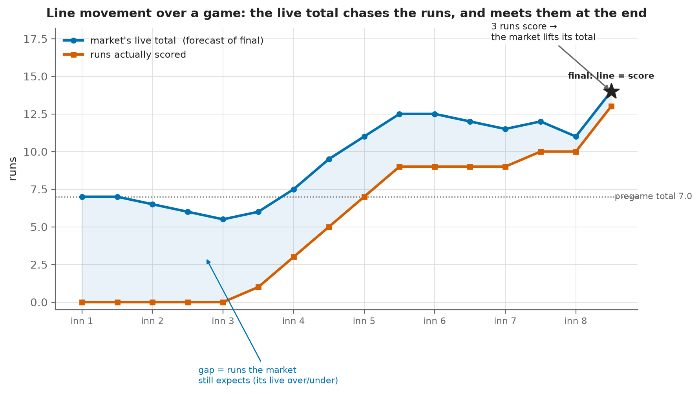
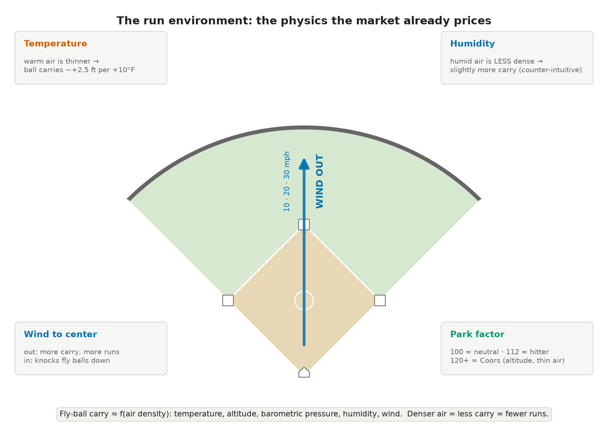

<h1>The Third Turn: A Visual Companion</h1>

Supplementary figures for talks, the repository, and curious readers. These are illustrative companions to the working paper, not part of its frozen analysis.

Companion to "From Pitcher Fatigue to Market Efficiency" &middot; July 2026

## Line movement: the live total tracks the runs

The paper's transfer function measures, across 6,414 events, how far the live total moves after each
play. This figure shows the same thing for a single game, so the mechanism is visible rather than
averaged. Everything is reconstructed from the committed snapshots: the live total is the market's
forecast of remaining runs plus the runs already scored, so it is the actual over/under number a
bettor would have watched.

**Figure S1.** One game's live over/under from first pitch through the eighth. The number opens at
the 7.0 pregame total, drifts down through three scoreless innings as the time left to score runs
out, then climbs with each scoring burst until it meets the runs actually scored at the game's final
of 13. The shaded gap is the market's live over/under on the rest of the game, and it closes to zero
as the game ends. This is a sharp market updating in real time, which is exactly why static
pregame beliefs, however true, do not survive contact with the live line.

## The run environment: the physics the market already prices

Scoring is a function of air density, and air density is a function of temperature, altitude,
barometric pressure, humidity, and wind. These relationships are well established, and none of them
is a secret. That is precisely the paper's point: because the run environment is public and
understood, a sharp market prices it, and in our sample it slightly over-adjusts.

**Figure S2.** Warm, thin, high-altitude air lets fly balls carry; a wind blowing out to center adds
carry, a wind blowing in knocks fly balls down; humid air is, counter-intuitively, slightly less
dense than dry air, so it too adds a little carry. Weather and park genuinely move runs. On this
evidence they do not move the price enough to beat it: in the conditional test, hitter-friendly
overs hit 46 percent against 50 percent, so if anything the market over-adjusts for exactly the
conditions a bettor would notice. The effect is real; the edge is not.
